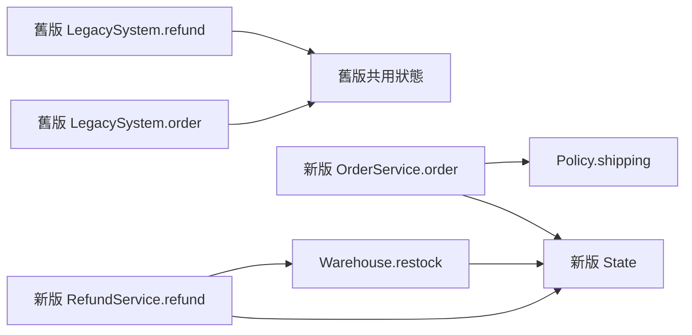

# C2：增量移轉批次 2 程式碼審查

## 1. 基本說明

- **結論：Request changes。** 批次 2 的退款業務一致性為 **FAIL**；有 1 項已確認的阻擋問題。先修正拒絕交易時的退款計數，再重驗。
- 審查開始：2026-09-28 17:56:43 +0800（Asia/Taipei）。
- 專案：`simple-skills`；審查材料為 [`C2/reader`](/Users/kengp3/Workspaces/mine/simple-skills/docs/research/ai-code-review-incremental-migration-validation-evidence/C2/reader)。本報告是隔離案例的審查建議，沒有遠端 PR 或平台審查動作。
- 執行狀態：已獨立核對來源、Probe、契約、固定版本、檔案雜湊與提供的九案例紀錄；本輪依唯讀限制沒有重新編譯或執行 Java。

## 2. 範圍說明

舊系統為 `legacy/main` `60492ed70cfb13ff86a9d46c5e0f1bb90efb268e`；新系統比較 `target/main` `244764e726224b81c4715f5946ba15bc70254f58` 至 `codex/refund-batch` `435f089b7839f25567fb133a088cb79f327d70ce` 的已提交變更。兩系統分屬不同來源，不假設共同祖先。新版 diff 只有新增 `RefundService.java` 和 `Warehouse.java`；批次 1 的 `OrderService.java`、`Policy.java`、`State.java` 及契約內容未變。版本標記與 [`manifest.json`](/Users/kengp3/Workspaces/mine/simple-skills/docs/research/ai-code-review-incremental-migration-validation-evidence/C2/reader/manifest.json) 相符，20 項列名檔案的 SHA-256 均相符。

驗收範圍依 [`CONTRACT.md`](/Users/kengp3/Workspaces/mine/simple-skills/docs/research/ai-code-review-incremental-migration-validation-evidence/C2/reader/CONTRACT.md:3)：批次 2 的退款規則及其與批次 1 訂單共用狀態的影響。獨立的 loyalty 操作屬後續批次。這是記憶體內、循序案例；資料庫交易、真實付款、訊息與部署均不在證據範圍內。

## 3. 關聯與流程

以下關聯圖呈現本次變更的狀態與副作用責任；操作順序見圖後說明。兩側是比較對象，彼此沒有執行期呼叫。



訂單先檢查負金額，再透過舊版內嵌門檻或新版 `Policy.shipping` 計算運費並附加 `O`。退款兩側均先查成功收據、再查 0–30 天期限；差別在拒絕路徑：舊版先增加 `gatewayCalls`，拒絕後直接返回，成功後才增加 `refunds`、補庫存及附加 `R`；新版在閘道判斷前已增加 `refunds`。新版 `Warehouse.restock` 對應舊版補庫存計數。兩個 Probe 均讓訂單與退款使用同一狀態，並輸出回傳值及完整狀態。

## 4. 審查結果與問題

| ID | 狀態與影響 | 建議及解除條件 |
| --- | --- | --- |
| F-01 | 已確認、阻擋。退款被拒絕仍增加成功退款計數，違反「decline 僅增加 gatewayCalls」的契約。 | 將 `state.refunds++` 移到拒絕判斷之後；重跑九個指定案例，另驗證拒絕後成功退款的計數與收據。 |

### F-01：拒絕交易誤記為成功退款

[新版 `RefundService.refund`](/Users/kengp3/Workspaces/mine/simple-skills/docs/research/ai-code-review-incremental-migration-validation-evidence/C2/reader/target-head/RefundService.java:7) 的原碼：

```java
state.refunds++;
state.gatewayCalls++;
if (decline) return "DECLINED";
Warehouse.restock(state);
```

[舊版 `LegacySystem.refund`](/Users/kengp3/Workspaces/mine/simple-skills/docs/research/ai-code-review-incremental-migration-validation-evidence/C2/reader/legacy/LegacySystem.java:16) 在 `if (decline)` 之後才執行 `refunds++`。最小建議修改是移除新版第 10 行，並在第 12 行拒絕判斷之後插入 `state.refunds++;`；此修法尚未套用或執行。

可達反例為新建狀態下 `refund("a", 29, true)`。[舊版紀錄](/Users/kengp3/Workspaces/mine/simple-skills/docs/research/ai-code-review-incremental-migration-validation-evidence/C2/reader/legacy-execution.json) 為 `DECLINED|0:0:0:1:`，[新版紀錄](/Users/kengp3/Workspaces/mine/simple-skills/docs/research/ai-code-review-incremental-migration-validation-evidence/C2/reader/target-execution.json) 為 `DECLINED|0:1:0:1:`，其中狀態依序為 `orderTotal:refunds:restocked:gatewayCalls:events`。兩側的 [Probe](/Users/kengp3/Workspaces/mine/simple-skills/docs/research/ai-code-review-incremental-migration-validation-evidence/C2/reader/target-Probe.java:12) 均直接呼叫相同參數，沒有上游 guard 排除此路徑。若拒絕後再以不同 key 成功退款，新版收據序號也會受錯誤計數影響；這是同一根因的後續效果，尚無獨立執行紀錄。

九個指定案例的完整輸出與狀態已逐項比對：`order7999`、`order8000`、`order8001`、`invalid`、`age30`、`age31`、`replay`、`sequence` 共八項一致；僅 `decline` 不一致。原始紀錄兩側的 `javac` 與九個 `java` 命令退出碼均為 0，但紀錄是材料提供的執行結果，本輪未重跑。來源審查未另確認安全、效能或相容性問題；此案例沒有外部授權、資料庫或訊息路徑可據以審查真實系統副作用。

## 5. 結論

**批次 2：Request changes，業務一致性 FAIL。** F-01 直接違反明示契約，即使另外八個案例一致也不能建議通過。修正後須在同一固定版本的來源及等價初始狀態下重驗完整輸出與狀態，包含拒絕後成功的序列；目前提供的舊紀錄不能充作修正版的驗證。

**整體移轉：尚未完成。** 本批阻擋未解除，且 loyalty 是契約指定的後續獨立批次；不得將本批審查結論擴大為整個新系統等價或可切換。

## 附錄：證據邊界與完整檔案清單

本輪只讀 [`SKILL.md`](/Users/kengp3/Workspaces/mine/simple-skills/skills/ai-code-review/SKILL.md) 及其 `migration.md`、`deep-review.md`、`report.md` 指引，並核對 `reader` 包內材料。`git bundle list-heads` 顯示的舊版與新版 base/head 均符合 manifest；`diff -ru` 顯示新版 base/head 快照只有兩個新增 Java 檔。雜湊核對證明提供的快照與 manifest 相符；未從 bundle 重新抽取 Git tree，也未重新執行 Java，因此不把提供的 log 稱作本輪實跑證據。

| 狀態與檔案 | 責任及審查結果 |
| --- | --- |
| 新增 [`target-head/RefundService.java`](/Users/kengp3/Workspaces/mine/simple-skills/docs/research/ai-code-review-incremental-migration-validation-evidence/C2/reader/target-head/RefundService.java:1) | 收據重播、期限、閘道與退款副作用；F-01。 |
| 新增 [`target-head/Warehouse.java`](/Users/kengp3/Workspaces/mine/simple-skills/docs/research/ai-code-review-incremental-migration-validation-evidence/C2/reader/target-head/Warehouse.java:1) | 成功退款的補庫存計數；與舊版相應路徑一致。 |
| 未變 [`target-base/OrderService.java`](/Users/kengp3/Workspaces/mine/simple-skills/docs/research/ai-code-review-incremental-migration-validation-evidence/C2/reader/target-base/OrderService.java:1)／[`target-head/OrderService.java`](/Users/kengp3/Workspaces/mine/simple-skills/docs/research/ai-code-review-incremental-migration-validation-evidence/C2/reader/target-head/OrderService.java:1) | 批次 1 訂單入口；指定訂單及序列案例與舊版一致。 |
| 未變 [`target-base/Policy.java`](/Users/kengp3/Workspaces/mine/simple-skills/docs/research/ai-code-review-incremental-migration-validation-evidence/C2/reader/target-base/Policy.java:1)／[`target-head/Policy.java`](/Users/kengp3/Workspaces/mine/simple-skills/docs/research/ai-code-review-incremental-migration-validation-evidence/C2/reader/target-head/Policy.java:1) | 8,000 分運費門檻；指定邊界案例一致。 |
| 未變 [`target-base/State.java`](/Users/kengp3/Workspaces/mine/simple-skills/docs/research/ai-code-review-incremental-migration-validation-evidence/C2/reader/target-base/State.java:1)／[`target-head/State.java`](/Users/kengp3/Workspaces/mine/simple-skills/docs/research/ai-code-review-incremental-migration-validation-evidence/C2/reader/target-head/State.java:1) | 訂單與退款共用的可觀測狀態；F-01 的錯誤欄位為 `refunds`。 |
| 未變 `CONTRACT.md`（舊版、新版 base/head 與包內副本） | 驗收規則與批次邊界；四份內容雜湊相同。 |
| 關聯 [`legacy/LegacySystem.java`](/Users/kengp3/Workspaces/mine/simple-skills/docs/research/ai-code-review-incremental-migration-validation-evidence/C2/reader/legacy/LegacySystem.java:1) | 舊訂單、退款與狀態規則；loyalty 僅確認為後續範圍。 |
| 關聯 [`legacy-Probe.java`](/Users/kengp3/Workspaces/mine/simple-skills/docs/research/ai-code-review-incremental-migration-validation-evidence/C2/reader/legacy-Probe.java:1)、[`target-Probe.java`](/Users/kengp3/Workspaces/mine/simple-skills/docs/research/ai-code-review-incremental-migration-validation-evidence/C2/reader/target-Probe.java:1) | 九個等價輸入及完整狀態輸出；未包含拒絕後成功序列。 |
| 關聯 `legacy.bundle`、`target.bundle`、`manifest.json`、`target.patch`、`legacy-execution.json`、`target-execution.json` | 固定版本、檔案核對、差異及提供的執行紀錄；已讀與交叉核對，未從 bundle 抽取或重跑。 |
