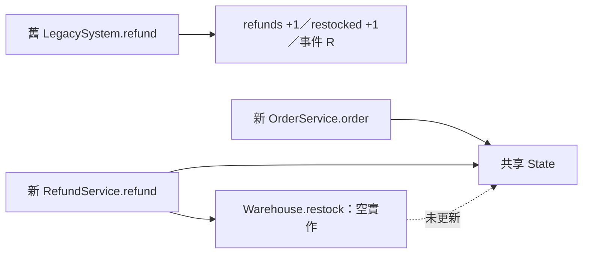

# C4：增量架構移轉 batch 2 審查

## 1. 基本說明

**結論：Request changes。**退款成功後未回補庫存，batch 2 業務一致性 **FAIL**；先修正 F-001，再重驗九個契約案例。整體移轉仍未完成。審查執行狀態為完成唯讀來源與既有執行紀錄查核；本輪未自行執行 Java。核對時間為 2026-09-28 17:57（Asia/Taipei）；開始時間未另行記錄。無遠端 PR，本建議不是平台 review 動作。

專案：[simple-skills](/Users/kengp3/Workspaces/mine/simple-skills)；固定證據：[C4/reader](/Users/kengp3/Workspaces/mine/simple-skills/docs/research/ai-code-review-incremental-migration-validation-evidence/C4/reader)。目的依 [契約](ai-code-review-incremental-migration-validation-evidence/C4/reader/CONTRACT.md)：比較 batch 2 退款與其影響的 batch 1 訂單；loyalty 屬後續獨立批次。

## 2. 範圍說明

舊側 `main` 為 `60492ed70cfb13ff86a9d46c5e0f1bb90efb268e`；新側 base `main` 為 `3418d3fc754539a7fdf6f586a6f944756539466b`，head `codex/refund-batch` 為 `4d44190f1f547a9a0983871ba54ff692d459f78e`，與 [manifest](ai-code-review-incremental-migration-validation-evidence/C4/reader/manifest.json) 及 bundle refs 相符。跨系統依業務契約對照，不推定共同 Git 祖先。新側 base→head 只有新增 `RefundService.java`、`Warehouse.java`；訂單、政策、狀態和契約內容未變。

查核九例 `order7999`、`order8000`、`order8001`、`invalid`、`age30`、`age31`、`decline`、`replay`、`sequence` 的完整 `output|state`。封存包 manifest 所列 20 個檔案雜湊全部吻合；雙側執行紀錄均載明編譯及各案例退出碼 0。紀錄是提供的既有輸出，本輪僅獨立比對，沒有重新執行；依契約，此範圍也不證明資料庫交易、外部付款、訊息或部署行為。

## 3. 關聯與流程

下圖呈現成功退款如何改動共享狀態，以及本次差異的責任點；箭頭依固定來源推導，並非兩系統互相呼叫。



[舊實作](ai-code-review-incremental-migration-validation-evidence/C4/reader/legacy/LegacySystem.java) 先查收據、再檢查年齡，成功時各遞增 `refunds`、`restocked` 並附加 `R`。[新退款](ai-code-review-incremental-migration-validation-evidence/C4/reader/target-head/RefundService.java) 保留收據優先、年齡與拒絕路徑，但把回補交給空的 [Warehouse.restock](ai-code-review-incremental-migration-validation-evidence/C4/reader/target-head/Warehouse.java)。[新訂單](ai-code-review-incremental-migration-validation-evidence/C4/reader/target-head/OrderService.java) 與退款共用 `State`；`sequence` 案例驗證此串接。

## 4. 審查結果與問題

| ID | 狀態／影響 | 建議及解除條件 |
| --- | --- | --- |
| F-001 | 已確認、阻擋：成功退款回傳收據但 `restocked` 未增加 | 在 `Warehouse.restock(State)` 完成一次回補，重驗 `age30`、`replay`、`sequence` 及九例總結果 |

### F-001：成功退款漏掉回補

[舊版 `LegacySystem.refund`](ai-code-review-incremental-migration-validation-evidence/C4/reader/legacy/LegacySystem.java) 第 18–20 行：

```java
refunds++;
restocked++;
events += "R";
```

[新版 `RefundService.refund`](ai-code-review-incremental-migration-validation-evidence/C4/reader/target-head/RefundService.java) 第 12–14 行與 [新版 `Warehouse.restock`](ai-code-review-incremental-migration-validation-evidence/C4/reader/target-head/Warehouse.java) 第 2 行：

```java
state.refunds++;
Warehouse.restock(state);
state.events += "R";
```

```java
public static void restock(State state) { /* pending later batch */ }
```

有效年齡且未拒絕的退款會走到此空方法。舊側 [`age30` 紀錄](ai-code-review-incremental-migration-validation-evidence/C4/reader/legacy-execution.json) 為 `REFUND:1|0:1:1:1:R`，新側 [紀錄](ai-code-review-incremental-migration-validation-evidence/C4/reader/target-execution.json) 為 `REFUND:1|0:1:0:1:R`。`replay` 同樣少一次回補；先訂單再退款的 `sequence` 是舊 `REFUND:1|8000:1:1:1:OR`、新 `REFUND:1|8000:1:0:1:OR`。根因是一項，三例均受影響。契約只延後 loyalty，並未核准延後成功退款的回補。

**建議修法（尚未套用）：**在 `Warehouse.restock(State)` 中使 `state.restocked++` 恰好執行一次，保留現有收據重播與拒絕 guard。修後以等價初始狀態重新編譯及執行九例，確認完整回應及狀態相同。其餘六例現有紀錄相同：四個訂單案例的門檻與拒絕、`age31` 過期、`decline` 僅增加 gateway call；來源亦支持這些路徑。未發現其他可確認的本批差異。此記憶體內循序程式沒有可據以推論的外部授權或交易邊界。

## 5. 結論

**Batch 2：FAIL／Request changes。**F-001 是未核准的必要業務差異；修正並重驗後再判定。本批訂單相關路徑在提供的案例與固定來源中相同。**整體移轉：未完成。**除本批退款差異外，契約明定 loyalty 為後續獨立批次；它不單獨阻擋本批，但不能被計為已移轉。

### 完整檔案清單與證據

| 類別 | 檔案 | 本輪判斷 |
| --- | --- | --- |
| 新增 | [RefundService.java](ai-code-review-incremental-migration-validation-evidence/C4/reader/target-head/RefundService.java) | 退款 guard、計數、收據及事件已查；F-001 呼叫點 |
| 新增 | [Warehouse.java](ai-code-review-incremental-migration-validation-evidence/C4/reader/target-head/Warehouse.java) | 回補空實作；F-001 根因 |
| 新側未變 | [OrderService.java](ai-code-review-incremental-migration-validation-evidence/C4/reader/target-head/OrderService.java)、[Policy.java](ai-code-review-incremental-migration-validation-evidence/C4/reader/target-head/Policy.java)、[State.java](ai-code-review-incremental-migration-validation-evidence/C4/reader/target-head/State.java)、[CONTRACT.md](ai-code-review-incremental-migration-validation-evidence/C4/reader/target-head/CONTRACT.md) | 與 base 對照相同；訂單呼叫與共享狀態已查 |
| 舊側對照 | [LegacySystem.java](ai-code-review-incremental-migration-validation-evidence/C4/reader/legacy/LegacySystem.java)、[CONTRACT.md](ai-code-review-incremental-migration-validation-evidence/C4/reader/legacy/CONTRACT.md) | 訂單、退款與範圍規則已查；loyalty 僅作邊界辨識 |
| 執行證據 | [legacy-Probe.java](ai-code-review-incremental-migration-validation-evidence/C4/reader/legacy-Probe.java)、[target-Probe.java](ai-code-review-incremental-migration-validation-evidence/C4/reader/target-Probe.java)、[legacy-execution.json](ai-code-review-incremental-migration-validation-evidence/C4/reader/legacy-execution.json)、[target-execution.json](ai-code-review-incremental-migration-validation-evidence/C4/reader/target-execution.json) | 九例輸入與輸出已逐項對照；非本輪實跑 |
| 固定版本 | [manifest.json](ai-code-review-incremental-migration-validation-evidence/C4/reader/manifest.json)、[target.patch](ai-code-review-incremental-migration-validation-evidence/C4/reader/target.patch)、[legacy.bundle](ai-code-review-incremental-migration-validation-evidence/C4/reader/legacy.bundle)、[target.bundle](ai-code-review-incremental-migration-validation-evidence/C4/reader/target.bundle) | 雜湊及 bundle refs 已核對；未還原 bundle 工作樹 |
