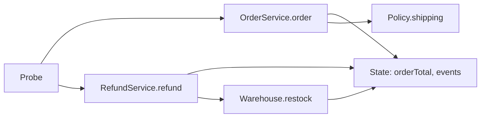

# C5：漸進式移轉 batch 2 審查

## 1. 基本說明

**建議：Hold（暫緩 batch 2 驗收）；業務一致性 UNKNOWN。** 沒有已確認的反例，但舊側退款的必要來源與執行觀測缺席。第一步是補齊舊版退款五個必測案例的完整輸出與狀態。這是無 remote PR 的離線範圍建議，未提交平台審查。

- 專案：`simple-skills`；審查材料為 [C5 reader](ai-code-review-incremental-migration-validation-evidence/C5/reader/)。
- 目的：檢查 batch 2 的退款移轉及受影響的 batch 1 訂單行為；loyalty 屬後續獨立批次，依 [合約](ai-code-review-incremental-migration-validation-evidence/C5/reader/CONTRACT.md)。
- 時間：2026-09-28 17:57:30 +0800 為本輪工具核對時點；開始時間未單獨記錄。
- 執行狀態：唯讀來源及既有紀錄審查；未重新編譯或執行 Java。

## 2. 範圍說明

目標 Git bundle 的 `main` 為 `242c1f372ae47b01003947e7e07986c283ee04a1`，`codex/refund-batch` 為 `d17bacb3a946f562e8960cf8422504c53f9879f9`。本次以兩個固定 commit 的 [patch](ai-code-review-incremental-migration-validation-evidence/C5/reader/target.patch) 與快照比較；變更只有新增 `RefundService.java`、`Warehouse.java`。`OrderService.java`、`Policy.java`、`State.java` 在 base/head 快照相同。Bundle 驗證為完整 history；封存 [manifest](ai-code-review-incremental-migration-validation-evidence/C5/reader/manifest.json) 所列 17 個檔案 SHA-256 均核對相符。

驗收邊界是合約列出的九個 in-memory、sequential 案例及各案例完整輸出與狀態。資料庫交易、真實付款、訊息與部署不在本包可證明範圍。舊側只有四個訂單案例的執行紀錄；[來源缺口](ai-code-review-incremental-migration-validation-evidence/C5/reader/legacy/SOURCE-GAP.md)明示舊退款原始碼不可得。

## 3. 關聯與流程

以下流程顯示兩批在同一 `State` 的可觀察關係；它由新側來源推導，只有 [Probe](ai-code-review-incremental-migration-validation-evidence/C5/reader/target-Probe.java) 所列案例具有提供的執行紀錄。

訂單先拒絕負數，再按 8000 cents 門檻計運費並寫入 `O`；head 的訂單程式與 base 相同。退款先以 key 查成功收據，再判斷年齡、呼叫 gateway、處理 decline；成功後各增加一次 refunds 與 restocked、附加一個 `R` 並保存收據，見 [RefundService.java](ai-code-review-incremental-migration-validation-evidence/C5/reader/target-head/RefundService.java#L7-L17)。`sequence` 在同一 `State` 先訂單後退款。

## 4. 審查結果與問題

| ID | 狀態與影響 | 解除條件 |
|---|---|---|
| U-001 | **必要證據缺口，阻擋 batch 2 驗收。** [舊側執行紀錄](ai-code-review-incremental-migration-validation-evidence/C5/reader/legacy-execution.json)僅有 `order7999`、`order8000`、`order8001`、`invalid`；沒有 `age30`、`age31`、`decline`、`replay`、`sequence` 的舊側輸出及狀態，且舊退款原始碼不可得。因此無法比較退款邊界、拒絕副作用、收據重播與跨批次序列。這是缺證，不是已確認的程式缺陷。 | 固定舊版退款來源及執行條件，以等價初態補齊五個案例的完整輸出與狀態；與同版新側逐項比對，差異另查核是否有明確核准例外。 |

[新側執行紀錄](ai-code-review-incremental-migration-validation-evidence/C5/reader/target-execution.json)記載編譯 exit 0、九個案例 exit 0。四個共同訂單案例的 exit code 與完整 stdout 均一致，包括 7999/8000/8001 cents 的運費邊界及負數拒絕。新側退款五個案例的結果與合約相符：30 天成功、31 天無副作用、decline 僅增加 gatewayCalls、replay 不重複副作用、sequence 最終狀態為 `8000:1:1:1:OR`。但這些不是舊新退款等價證據；紀錄中的編譯路徑指向暫存目錄，本輪未重跑，也未獨立核對暫存編譯輸入。

已查新側的年齡 guard、成功重播優先序、gateway decline、副作用計數及訂單共用狀態；在此限定範圍未找到可確認的安全、可靠性或程式品質阻擋。單次 sequential 案例不支持並行或持久化結論。

## 5. 結論

**batch 2：Hold；業務一致性 UNKNOWN。** 四個訂單案例有一致的觀測，新側退款符合提供的合約，但舊側退款五個必要案例缺席。補證並比對後才能重新判定 batch 2；若出現未核准差異，應改列已確認 finding。**整體移轉尚未完成**，因合約將 loyalty 排在後續獨立批次；其尚未移轉不額外阻擋本次 batch 2。

本次差異檔案清單：新增 [RefundService.java](ai-code-review-incremental-migration-validation-evidence/C5/reader/target-head/RefundService.java)（退款判斷、收據及狀態更新；U-001），新增 [Warehouse.java](ai-code-review-incremental-migration-validation-evidence/C5/reader/target-head/Warehouse.java)（成功退款時 restocked +1；U-001）。關聯但未修改：[OrderService.java](ai-code-review-incremental-migration-validation-evidence/C5/reader/target-head/OrderService.java)、[Policy.java](ai-code-review-incremental-migration-validation-evidence/C5/reader/target-head/Policy.java)、[State.java](ai-code-review-incremental-migration-validation-evidence/C5/reader/target-head/State.java)、[Probe](ai-code-review-incremental-migration-validation-evidence/C5/reader/target-Probe.java)、合約及上述兩側執行紀錄。
