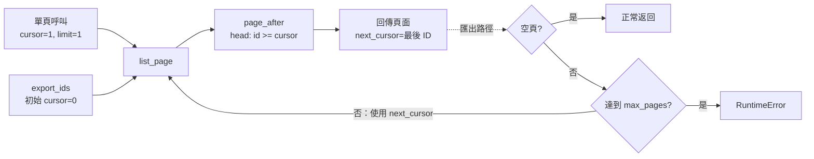

# 程式碼審查：游標分頁重構案例

## 1. 基本說明

- **執行狀態／建議：**已完成本次固定快照審查；**Request changes（要求修改）**。候選版違反游標邊界規格，並使匯出無法正常結束。
- **尚存事項：**已確認阻擋問題 [F-001](#f-001游標項目被重複納入導致分頁停滯) 1 項；待釐清問題 0 項；必要證據缺口 0 項。
- **現在先做：**恢復 `page_after` 的嚴格 `id > cursor` 比較，重跑本案例兩個入口的檢查。
- **專案／路徑：**[simple-skills](/Users/kengp3/Workspaces/mine/simple-skills)；[案例目錄](/Users/kengp3/Workspaces/mine/simple-skills/docs/research/ai-code-review-paging-20260925-evidence)。
- **本輪可核對的執行起點：**2026-09-25 22:45:20 +08:00（Asia/Taipei；第一組固定快照驗證開始時間）。較早的閱讀起點未記錄，不能冒稱為審查開始時間。
- **目的：**依目前 `ai-code-review` skill 審查一個可重跑的分頁重構案例。這是本機演練；沒有 PR、Git base/head commit、部署或平台審查動作。

## 2. 範圍說明

本次以 [規格](input/SPEC.md) 為判斷基準，對 [base](input/base/paging.py) 與 [head](input/head/paging.py) 兩組**固定檔案快照直接比較**；不是 `git diff` 的 merge-base 比較。快照完整性與差異由 [manifest](input/manifest.json)、[原始 patch](input/diff.patch) 及 [實際核對紀錄](observations.json) 固定。唯一差異是 `paging.py` 第 2 行，1 個 hunk、1 行刪除、1 行新增。兩版的 `api.py`、`export.py` 內容相同，但均納入 caller 分析與執行。

本次只評估 [案例輸入](input/README.md) 所定義的有效資料：唯一且遞增的整數 ID、初始游標 0、正整數 `limit`／`max_pages`。未涵蓋真實服務整合、不同資料排序、並行寫入或其他專案程式；結論只適用這個固定案例。完整目標與關聯檔案見[最末端清單](#附錄完整檔案清單)。

## 3. 關聯與流程

[規格](input/SPEC.md:3)要求游標代表「最後已交付的 ID」，下一頁只能回傳更大的 ID。改動發生在共用的 `page_after`；[API](input/head/api.py:3) 以該頁最後一筆更新 `next_cursor`，[匯出](input/head/export.py:3) 則持續呼叫 API，直到空頁或達到 `max_pages`。因此一行比較式同時影響單頁結果與連續匯出。

下圖用流程圖呈現游標如何沿兩個 caller 傳遞，以及保護例外何時發生；這是來源推導，圖中的兩個結果另有 [實跑紀錄](observations.json) 驗證。



圖只表示有問題的 head 路徑；base 使用 `>`，相同游標不會重取已交付項目。圖未獨立渲染作視覺驗證，來源與執行紀錄仍可直接查閱。

## 4. 審查結果與問題

| ID／狀態 | 問題與影響 | 阻擋理由 | 推薦方案 | 解除條件 |
|---|---|---|---|---|
| [F-001](#f-001游標項目被重複納入導致分頁停滯)／open | 游標項目重複出現；批次匯出達到保護上限後失敗 | 違反 [規格](input/SPEC.md:3) 的 `id > cursor`、不重複與正常終止要求 | 在共用 `page_after` 改回嚴格大於 | 重跑 API 邊界與匯出遍歷，head 兩項均通過 |

### F-001：游標項目被重複納入導致分頁停滯

**位置與歸屬：**候選快照 [head/paging.py 第 2 行](input/head/paging.py:2)，`page_after(rows, cursor, limit)`；本次重構新增。受影響的 caller 是 [list_page](input/head/api.py:3) 與 [export_ids](input/head/export.py:3)。規格要求 `id > cursor`，而原始 [base/paging.py 第 2 行](input/base/paging.py:2) 確實採用嚴格大於。

**原始問題碼（head，原樣摘錄）：**

```python
def page_after(rows, cursor, limit):
    return [row for row in rows if row["id"] >= cursor][:limit]
```

**建議修改（替換第 2 行；尚未套用或驗證修後版本）：**

```python
def page_after(rows, cursor, limit):
    return [row for row in rows if row["id"] > cursor][:limit]
```

輸入 `rows=[{"id":1},{"id":2},{"id":3}]`、`cursor=1`、`limit=1` 時，預期下一頁是 ID 2；head 會再次選入 ID 1，且 [API](input/head/api.py:4) 將 `next_cursor` 保持為 1。[probe](input/probe.py:4) 在 base 退出碼 0，在 head 的第 5 行斷言退出碼 1。這支 probe 在該斷言即停止，**沒有執行 head 的匯出斷言**；我們另行呼叫 `export_ids(..., limit=1, max_pages=5)`，base 輸出 `[1, 2, 3]`、退出碼 0，head 在 [匯出保護](input/head/export.py:12) 拋出 `RuntimeError: pagination did not terminate`、退出碼 1。命令、原始 stdout/stderr 與退出碼均在[執行紀錄](observations.json)。

**反證查核：**已讀兩版完整的三個模組。`list_page` 沒有過濾已交付 ID；`export_ids` 只在空頁返回，`max_pages` 只會將停滯變成例外，無法使結果正確。兩個 caller 未變動，故單一根因記為一項 finding。此錯誤在規格允許的有效輸入下可達，並阻擋本次重構的行為保留。

**解除條件：**修正共用比較式後，以同一快照條件重跑 `probe.py`，確認游標 1 的下一頁為 ID 2，且完整匯出恰為 `[1, 2, 3]`、正常結束。更新修後快照與執行證據再重審；本報告未修改被審程式。

**其餘查核：**正確性、caller／資料流、終止保護、測試斷言與快照相容性已依上述來源及實跑檢查。案例沒有身分、外部 I/O、共享可變狀態或依賴變更，因此安全授權、交易、並行及供應鏈面向在此範圍不適用；本次未對大資料量量測效能，且不以此推定獨立效能缺陷。

## 5. 結論

對此固定 head 快照的建議是 **Request changes**。未解除的 F-001 已由有效輸入及兩個入口的實跑結果證實；先修正 `page_after`，再固定新版本重跑 API 邊界與匯出遍歷，兩者符合規格後才能重新評估。這是案例審查結論，並非真實 PR 的平台狀態或整個專案的品質保證。

## 附錄：證據與查核依據

- [輸入規格](input/SPEC.md)、[案例說明](input/README.md)、[直接差異](input/diff.patch)、[快照 manifest](input/manifest.json)；[觀測紀錄](observations.json) 記載 Python 3.14.7、命令、`PYTHONPATH`、退出碼與原始輸出。六個原碼檔與 patch 的內容雜湊均與 manifest 相符。
- 實際採用 [ai-code-review skill](../../../skills/ai-code-review/SKILL.md)、[deep-review 規則](../../../skills/ai-code-review/references/deep-review.md)、[report 規則](../../../skills/ai-code-review/references/report.md)；開發流程參照使用者指定的 `using-agent-skills`，並以 `code-review-and-quality`、`test-driven-development` 檢查審查與紅綠案例的安排。
- 檔案 SHA-256 集中在[核對索引](hashes.md)；正文不重複列值。這些值只固定本輪本機檔案，不代表 Git commit。案例原始 probe 對 head 只到第一個斷言，匯出結果來自獨立補跑。

## 附錄：完整檔案清單

| 狀態／舊 → 新 | 責任與差異作用 | 分析結果 |
|---|---|---|
| 修改：[base/paging.py](input/base/paging.py:1) → [head/paging.py](input/head/paging.py:1) | `page_after` 的比較由 `>` 改為 `>=`；唯一差異區塊 | 已讀完整函式與 patch；F-001 根因 |

| 關聯但未修改的來源／材料 | 責任 | 分析狀態 |
|---|---|---|
| [base/api.py](input/base/api.py:1)、[head/api.py](input/head/api.py:1) | `list_page` 呼叫分頁函式、產生 `next_cursor` | 兩版完整閱讀並執行；F-001 受影響入口 |
| [base/export.py](input/base/export.py:1)、[head/export.py](input/head/export.py:1) | `export_ids` 遍歷頁面及 `max_pages` 保護 | 兩版完整閱讀並執行；F-001 受影響入口 |
| [SPEC.md](input/SPEC.md)、[README.md](input/README.md) | 驗收契約、案例執行說明 | 已讀；確立有效輸入與比較語意 |
| [probe.py](input/probe.py:1) | 單頁與匯出斷言 | 已讀並在兩版執行；head 第一斷言即停止 |
| [diff.patch](input/diff.patch)、[manifest.json](input/manifest.json) | 差異與六個原碼快照固定證據 | 已核對全部條目與 patch |
| [observations.json](observations.json) | 原始執行證據 | 已核對退出碼與 stdout/stderr |
