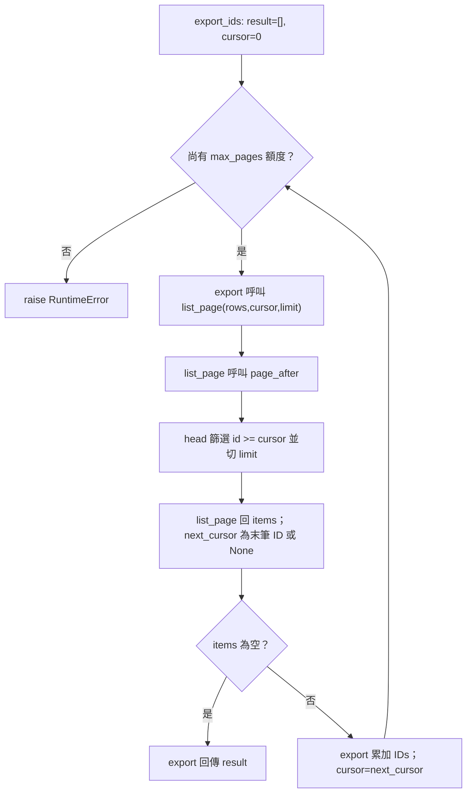

# 程式碼審查：游標分頁重構

## 1. 基本說明

- **建議：Request changes（要求修改）；審查完成，需求符合性／行為保留 FAIL。**
- 尚存事項：1 項已確認阻擋缺陷 F-001（F 表示已確認缺陷），0 項待釐清，0 項必要證據缺口；詳見 [問題總表](#4-審查結果與問題)。
- 現在先做：在共用 `page_after` 恢復排他比較 `id > cursor`，再跑入口與匯出回歸。隔離副本已驗證此修法；被審 head 尚未修改。
- 專案：simple-skills；[完整根目錄](/Users/kengp3/Workspaces/mine/simple-skills)。被審快照：[s1](/Users/kengp3/Workspaces/mine/simple-skills/docs/research/ai-code-review-poc-20260928-evidence/s1)。
- 本輪開始：2026-09-28 14:32:50 +08:00（Asia/Taipei）。
- 目的：核對分頁重構是否保留已交付游標排他性、next_cursor 與恰好一次匯出；限資料包公開方法，不含部署或其他 repository。

## 2. 範圍說明

| 基準 | 候選 | 比較語意 |
|---|---|---|
| [base 快照](/Users/kengp3/Workspaces/mine/simple-skills/docs/research/ai-code-review-poc-20260928-evidence/s1/base) | [head 快照](/Users/kengp3/Workspaces/mine/simple-skills/docs/research/ai-code-review-poc-20260928-evidence/s1/head) | 固定檔案內容直接比較；無 branch、commit、PR，不使用 merge-base |

[diff.patch](/Users/kengp3/Workspaces/mine/simple-skills/docs/research/ai-code-review-poc-20260928-evidence/s1/diff.patch) 共 1 個修改檔、1 個差異區塊：Python 比較式 `>` 改為 `>=`。先盤點全部 3 個 base/head 原碼檔，再追蹤未修改的 API 與 export caller；契約、probe、manifest 及提供的執行紀錄全部讀取。沒有新增／刪除／改名、二進位或生成檔。逐檔盤點位於 [完整檔案清單](#附錄完整檔案清單)。未把宿主 workspace 其他修改或其他情境納入。

## 3. 關聯與流程

[契約](/Users/kengp3/Workspaces/mine/simple-skills/docs/research/ai-code-review-poc-20260928-evidence/s1/contract.json)要求 rows 為唯一遞增整數 ID、cursor 為已交付的最後 ID、limit/max_pages 為正整數。`page_after` 必須只含大於 cursor 的資料；`list_page` 回傳末筆 ID 或空頁 None；`export_ids` 累積結果直到空頁，max_pages 保留異常保護。

變更目的為保持行為的重構；實際作用是把已交付的末筆重新選入，API 將它再次送出，export 在末尾持續收到非空頁。函式只產生新清單，不修改 rows；資料重複及失敗影響所有經 `page_after` 的已提供 caller。

因本次風險由分支與迴圈終止條件決定，使用一張流程圖說明 head 的完整呼叫路徑與失敗出口。來源：[paging](/Users/kengp3/Workspaces/mine/simple-skills/docs/research/ai-code-review-poc-20260928-evidence/s1/head/paging.py:1)、[api](/Users/kengp3/Workspaces/mine/simple-skills/docs/research/ai-code-review-poc-20260928-evidence/s1/head/api.py:3)、[export](/Users/kengp3/Workspaces/mine/simple-skills/docs/research/ai-code-review-poc-20260928-evidence/s1/head/export.py:3)；屬來源推導，入口與最終結果另有實測，未聲稱逐步執行追蹤。



base 的 D→E 篩選為 `id > cursor`，其他箭頭與分支相同。head 在非空資料末端不再走到空頁；max_pages 會結束迴圈並拋錯，因此不是無上限的實際無限迴圈。圖未擴充資料包外的服務入口。

## 4. 審查結果與問題

| ID／狀態 | 問題與影響 | 是否阻擋／理由 | 推薦方案 | 解除條件 |
|---|---|---|---|---|
| [F-001](#f-001)／open | 游標包含等號，重複交付末筆並導致匯出耗盡頁數拋錯 | 是；違反明文排他分頁與正常匯出要求 | 共用函式恢復 `>` | 在修正後固定版本驗證排他、末頁與不同 limit 的匯出；保留 max_pages 保護 |

### F-001

**已交付游標再次被選入，公開分頁回重複資料且匯出無法正常完成。** 歸屬為本次新增回歸，影響正常資料的正確性及可用性；團隊未提供嚴重度級別，不自訂級別政策。

根因：head [paging.py](/Users/kengp3/Workspaces/mine/simple-skills/docs/research/ai-code-review-poc-20260928-evidence/s1/head/paging.py:1)，`page_after(rows, cursor, limit)` 第 2 行；原始碼完整摘錄：

```python
def page_after(rows, cursor, limit):
    return [row for row in rows if row["id"] >= cursor][:limit]
```

建議替換第 2 行，保留函式簽名與切頁行為；下列修法已在隔離副本跑相同斷言通過，並未套用至被審原碼：

```python
def page_after(rows, cursor, limit):
    return [row for row in rows if row["id"] > cursor][:limit]
```

受影響入口：head [api.py](/Users/kengp3/Workspaces/mine/simple-skills/docs/research/ai-code-review-poc-20260928-evidence/s1/head/api.py:3) 第 3–5 行，原始碼：

```python
def list_page(rows, cursor=0, limit=2):
    batch = page_after(rows, cursor, limit)
    return {"items": batch, "next_cursor": batch[-1]["id"] if batch else None}
```

head [export.py](/Users/kengp3/Workspaces/mine/simple-skills/docs/research/ai-code-review-poc-20260928-evidence/s1/head/export.py:3) 第 3–12 行，原始碼（保留初始化、空頁 guard 與頁數保護）：

```python
def export_ids(rows, limit=2, max_pages=10):
    result = []
    cursor = 0
    for _ in range(max_pages):
        page = list_page(rows, cursor, limit)
        if not page["items"]:
            return result
        result.extend(row["id"] for row in page["items"])
        cursor = page["next_cursor"]
    raise RuntimeError("pagination did not terminate")
```

具體案例：`rows=[{"id":1},{"id":2},{"id":3}]`，呼叫 `list_page(rows,1,1)` 應回 ID 2／cursor 2，head 回 ID 1／cursor 1；`export_ids(rows,1,5)` 預期 `[1,2,3]`，head 拋 `RuntimeError("pagination did not terminate")`。以 cursor 3 查末頁時，應回空頁／None，head 再回 ID 3。

反證查核：呼叫者均把 next_cursor 原樣傳回，沒有加一或過濾已交付列；契約也不允許把 cursor 解讀成下一筆。空頁 guard 只處理空清單，max_pages 僅避免無限執行，不能修復重複交付。對同根因只列一項 finding，不另將匯出症狀重複計數。

本輪 [原始 log](/Users/kengp3/Workspaces/mine/simple-skills/docs/research/ai-code-review-poc-20260928-evidence/s1-review-r1.json) 中提供 probe 的 base/head 都 exit 0，因 probe 會捕捉錯誤後輸出；這不表示通過。新增 8 個斷言觀測的 base 全數通過（exit 0），head 5 個失敗（exit 1）：排他、末頁及 limit 1/2/4 匯出。空資料與輸入不被修改檢查通過。隔離修法 8/8 通過（exit 0）。解除仍需修正正式候選快照，對該版本重跑上述斷言與 probe。

### 已查面向與邊界

| 面向 | 方法／結果 |
|---|---|
| 正確性、相容性 | 全部方法、caller 與契約逐行核對；保留行為要求失敗，F-001 |
| 信任邊界、安全 | 本次契約已限制排序唯一 ID 及正 limit/max_pages；無資料庫、外部命令、敏感資訊 sink。未要求新增 API 驗證 |
| 可靠性、效能 | max_pages guard 仍在；迴圈重複到保護上限。篩選仍全表掃描與建立清單，未新增不同複雜度，不以未量測的效能偏好另報問題 |
| 設計、測試 | 共用 paging 為唯一根因修正點；probe 僅輸出觀測，另加可失敗斷言驗證；無新依賴 |
| 並行、副作用 | 全部為同步區域資料運算，無共享寫入、交易、事件或外部整合，相關併發／提交查核不適用 |

本輪以契約允許的正 ID 與足夠 max_pages 重現新增回歸；未把初始 cursor=0 下的非正 ID 或過小頁數額度等既有行為擴張成本次修復範圍。有限實測不代表所有輸入均已窮盡。

## 5. 結論

此 head 在約定重構範圍 **FAIL／Request changes**；審查步驟完成，F-001 仍 open，沒有必要證據缺口。建議下一步：將 `page_after` 恢復嚴格大於，再以新固定版本重跑排他、末頁、空頁及 limit 1/2/4 匯出案例；只有修正候選版本的證據有效後才可解除。隔離修法成功不代表目前 head 已修正。

## 附錄：證據與查核依據

- 本輪共同起始時間由時鐘工具取得：2026-09-28 06:32:50 UTC，換算 Asia/Taipei 為 14:32:50 +08:00；實跑時間保留於 [本輪原始 log](/Users/kengp3/Workspaces/mine/simple-skills/docs/research/ai-code-review-poc-20260928-evidence/s1-review-r1.json)。模型精確版本未知。
- 使用 [ai-code-review SKILL](/Users/kengp3/Workspaces/mine/simple-skills/docs/research/ai-code-review-poc-20260928-evidence/skill-r1/SKILL.md)、[deep-review](/Users/kengp3/Workspaces/mine/simple-skills/docs/research/ai-code-review-poc-20260928-evidence/skill-r1/references/deep-review.md)、[report](/Users/kengp3/Workspaces/mine/simple-skills/docs/research/ai-code-review-poc-20260928-evidence/skill-r1/references/report.md) 與 [文件規則](/Users/kengp3/Workspaces/mine/simple-skills/project-setting.md)；未修改技能。未發現根目錄、docs 或 docs/research 下另有 AGENTS.md；本次對話指示亦適用。
- 原始 manifest 全項核對成功；以 Python difflib.unified_diff 重建全部 base/head 檔案差異，結果與 diff.patch 逐字相同。執行後重新核對，輸入無變更。
- Python 3.14.7；以 `PYTHONPATH=<base 或 head> python3 -B <probe.py>` 重跑，另以 `python3 -B -c <assertion source>` 查核；完整 argv、cwd、環境路徑、stdout、stderr 與退出碼均在本輪 log，不以提供的 execution.json 冒稱本輪實跑。
- 原碼、契約、probe、既有執行紀錄、manifest、規則、技能、工具及本輪 log 的完整 SHA-256 集中於 [hash 核對索引](/Users/kengp3/Workspaces/mine/simple-skills/docs/research/ai-code-review-poc-s1-r1-20260928-hashes.research.md)。以快照技能的 `scripts/check_report_hashes.py` 實際驗證索引：17 筆全部通過，exit 0。
- Mermaid 圖依原碼查核節點與分支，未實際渲染；不宣稱視覺驗證。報告是本地快照演練建議，無真實 PR；未提交平台 review，未查核合併規則。

## 附錄：完整檔案清單

| 狀態／舊→新路徑 | 責任與差異區塊 | 影響／分析結果 |
|---|---|---|
| M：[base/paging.py](/Users/kengp3/Workspaces/mine/simple-skills/docs/research/ai-code-review-poc-20260928-evidence/s1/base/paging.py) → [head/paging.py](/Users/kengp3/Workspaces/mine/simple-skills/docs/research/ai-code-review-poc-20260928-evidence/s1/head/paging.py) | `page_after`，唯一 hunk 第 1–2 行，比較 `>`→`>=` | 全檔已讀；破壞排他性，F-001 |

關聯但未修改的來源及證據：

| 檔案 | 責任／分析狀態 |
|---|---|
| [base/api.py](/Users/kengp3/Workspaces/mine/simple-skills/docs/research/ai-code-review-poc-20260928-evidence/s1/base/api.py)、[head/api.py](/Users/kengp3/Workspaces/mine/simple-skills/docs/research/ai-code-review-poc-20260928-evidence/s1/head/api.py) | 完整讀取；呼叫 page_after，回傳 items 與末筆 cursor，受 F-001 影響 |
| [base/export.py](/Users/kengp3/Workspaces/mine/simple-skills/docs/research/ai-code-review-poc-20260928-evidence/s1/base/export.py)、[head/export.py](/Users/kengp3/Workspaces/mine/simple-skills/docs/research/ai-code-review-poc-20260928-evidence/s1/head/export.py) | 完整讀取；初始化、累加、游標推進、空頁退出與 max_pages 錯誤皆核對，受 F-001 影響 |
| [contract.json](/Users/kengp3/Workspaces/mine/simple-skills/docs/research/ai-code-review-poc-20260928-evidence/s1/contract.json)、[probe.py](/Users/kengp3/Workspaces/mine/simple-skills/docs/research/ai-code-review-poc-20260928-evidence/s1/probe.py) | 契約與現有 runner 已讀；probe 本輪 base/head 重跑 |
| [diff.patch](/Users/kengp3/Workspaces/mine/simple-skills/docs/research/ai-code-review-poc-20260928-evidence/s1/diff.patch)、[manifest.json](/Users/kengp3/Workspaces/mine/simple-skills/docs/research/ai-code-review-poc-20260928-evidence/s1/manifest.json)、[execution.json](/Users/kengp3/Workspaces/mine/simple-skills/docs/research/ai-code-review-poc-20260928-evidence/s1/execution.json) | 比較、完整性與提供的歷史觀測已核對；實跑另存本輪 log |

所有 1 個變更目標及必要關聯均完成；無生成／二進位、未讀或待查目標。排除宿主其他工作樹變更及資料包外服務，未將其列為必要缺口。
