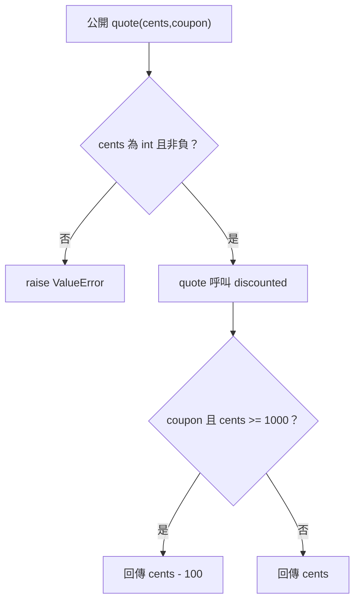

# 程式碼審查：核准的優惠門檻變更

## 1. 基本說明

- **建議：Approve（建議通過）；審查完成，需求符合性／品質 PASS。**
- 尚存事項：0 項阻擋、0 項待釐清、0 項必要證據缺口；詳見 [審查結果](#4-審查結果與問題)。無需提出程式修法。
- 專案：simple-skills；[完整根目錄](/Users/kengp3/Workspaces/mine/simple-skills)。被審快照：[s2](/Users/kengp3/Workspaces/mine/simple-skills/docs/research/ai-code-review-poc-20260928-evidence/s2)。
- 本輪開始：2026-09-28 14:32:50 +08:00（Asia/Taipei）。
- 目的：確認公開 quote 在 1,000 分含門檻套用 100 分優惠，保留其餘行為及輸入拒絕。
- 邊界：本地快照演練；契約明定不需外部整合。結論只適用該公開入口及固定版本，並非全域等價或平台核准。

## 2. 範圍說明

| 基準 | 候選 | 比較語意 |
|---|---|---|
| [base 快照](/Users/kengp3/Workspaces/mine/simple-skills/docs/research/ai-code-review-poc-20260928-evidence/s2/base) | [head 快照](/Users/kengp3/Workspaces/mine/simple-skills/docs/research/ai-code-review-poc-20260928-evidence/s2/head) | 檔案內容直接比較；無 branch、commit 或 PR，不使用 merge-base |

[diff.patch](/Users/kengp3/Workspaces/mine/simple-skills/docs/research/ai-code-review-poc-20260928-evidence/s2/diff.patch)共 1 個修改檔、1 個差異區塊：Python `policy.py` 的 `>`→`>=`。先盤點全部 2 個 base/head 原碼檔，再讀取未變更公開入口、契約與 probe；無新增／刪除／改名、二進位或生成檔。完整清單見 [最後一節](#附錄完整檔案清單)。宿主工作樹其他變更及其他情境不在範圍。

## 3. 關聯與流程

[契約](/Users/kengp3/Workspaces/mine/simple-skills/docs/research/ai-code-review-poc-20260928-evidence/s2/contract.json)明確核准新門檻：非負整數 cents，在 coupon 啟用且 subtotal ≥ 1,000 分時減 100 分。base 在剛好 1,000 分不折扣，head 折扣後為 900 分；這是必要的新行為。其他金額、coupon-off 與拒絕行為應保持。

`quote` 先用 `type(cents) is not int or cents < 0` 拒絕無效輸入，再呼叫 `discounted`；policy 是內部運算，公開驗收邊界是 quote。原始碼已證實公開入口不能繞過 guard。兩者均不修改外部狀態。

因變更由金額門檻與入口驗證決定，使用流程圖說明條件及拒絕出口。來源：[head/api.py](/Users/kengp3/Workspaces/mine/simple-skills/docs/research/ai-code-review-poc-20260928-evidence/s2/head/api.py:3)、[head/policy.py](/Users/kengp3/Workspaces/mine/simple-skills/docs/research/ai-code-review-poc-20260928-evidence/s2/head/policy.py:1)；圖是來源推導，入口結果已實測，無中間執行追蹤宣稱。

base 的門檻為 `cents > 1000`，除此以外呼叫路徑相同；只在 1,000 分且啟用優惠時需要不同結果。圖不推測額外 API、金流或部署。

## 4. 審查結果與問題

**約定範圍未發現阻擋或必要證據缺口，無尚存 F（已確認缺陷）、Q（待釐清）或 U（必要證據缺口）。** 不將已核准的門檻差異列為回歸，也不要求內部 policy 重複公開入口的輸入驗證。

| 實測輸入（單位：分） | coupon | base | head／新契約預期 |
|---|---|---|---|
| 999 | true | 999 | 999 |
| 1000 | true | 1000 | 900 |
| 1001 | true | 901 | 901 |
| 1000、1001 | false | 原金額 | 原金額 |
| 0 | true | 0 | 0 |
| -1、1.5、true、字串 `"1000"`、None | true | ValueError | ValueError |
| `10**100` | true | 原金額減 100 | 原金額減 100，無固定寬度整數溢位 |

本輪 [原始 log](/Users/kengp3/Workspaces/mine/simple-skills/docs/research/ai-code-review-poc-20260928-evidence/s2-review-r1.json)：提供 probe 在兩版皆 exit 0；額外 12 個以新契約為預期的斷言，head 12/12 通過（exit 0）。base 僅 1,000 分且 coupon=true 失敗（exit 1），證明斷言能辨認尚未符合新規格的舊版本。這不表示舊版當時違反舊需求，也不把 base 失敗作為 head 阻擋。

| 已查面向 | 方法與結果 |
|---|---|
| 正確性、相容性 | 全部 diff 與完整方法／caller 核對；正數門檻、零值、coupon-off 與拒絕輸入已執行。唯一行為差異符合明確核准需求 |
| 安全與信任邊界 | quote 的型別與非負 guard 在內部呼叫前；bool 不被當作金額 int 接受；無外部命令、SQL 或敏感輸出 sink |
| 可靠性、副作用、並行 | 純同步計算，無可變共享狀態、I/O、交易、重試或資源關閉；不適用提交與競速驗證 |
| 效能與精度 | 相同常數次比較與整數減法；不新增掃描、相依或資源持有。大整數補測成功；無浮點金額運算 |
| 設計、測試 | 共用 policy 保留 API 與簡單責任；probe 原本只輸出觀測，補上可失敗斷言，base/head 紅綠對照有效 |

coupon 的額外型別規範未指定，也未被此 diff 改動；不藉此創造必要補證。範圍內沒有外部整合需求；未驗證部署不是 Hold 理由。

## 5. 結論

固定 head 在核准需求與已提供公開入口範圍 **PASS／Approve**；全目標關聯分析、來源審查及必要實跑均完成，沒有待解除事項。此建議不宣稱新舊完全一致；剛好 1,000 分的優惠差異正是新需求。若後續改動公開入口、門檻或契約，應按影響重新驗證。

## 附錄：證據與查核依據

- 本輪共同起始時間由時鐘工具取得：2026-09-28 06:32:50 UTC，換算 Asia/Taipei 為 14:32:50 +08:00；實跑時間保留於 [本輪原始 log](/Users/kengp3/Workspaces/mine/simple-skills/docs/research/ai-code-review-poc-20260928-evidence/s2-review-r1.json)。模型精確版本未知。
- 使用 [ai-code-review SKILL](/Users/kengp3/Workspaces/mine/simple-skills/docs/research/ai-code-review-poc-20260928-evidence/skill-r1/SKILL.md)、[deep-review](/Users/kengp3/Workspaces/mine/simple-skills/docs/research/ai-code-review-poc-20260928-evidence/skill-r1/references/deep-review.md)、[report](/Users/kengp3/Workspaces/mine/simple-skills/docs/research/ai-code-review-poc-20260928-evidence/skill-r1/references/report.md) 與 [文件規則](/Users/kengp3/Workspaces/mine/simple-skills/project-setting.md)；未修改技能。未發現根目錄、docs 或 docs/research 下另有 AGENTS.md；本次對話指示亦適用。
- 原始 manifest 全項核對成功；以 Python difflib.unified_diff 重建全部 base/head 檔案差異，結果與 diff.patch 逐字相同。執行後重新核對，輸入無變更。
- Python 3.14.7；以 `PYTHONPATH=<base 或 head> python3 -B <probe.py>` 重跑，另以 `python3 -B -c <assertion source>` 查核；完整 argv、cwd、環境路徑、stdout、stderr 與退出碼均在本輪 log，不以提供的 execution.json 冒稱本輪實跑。
- 原碼、契約、probe、既有執行紀錄、manifest、規則、技能、工具及本輪 log 的完整 SHA-256 集中於 [hash 核對索引](/Users/kengp3/Workspaces/mine/simple-skills/docs/research/ai-code-review-poc-s2-r1-20260928-hashes.research.md)。以快照技能的 `scripts/check_report_hashes.py` 實際驗證索引：15 筆全部通過，exit 0。
- Mermaid 圖依原碼查核節點與分支，未實際渲染；不宣稱視覺驗證。報告是本地快照演練建議，無真實 PR；未提交平台 review，未查核合併規則。

## 附錄：完整檔案清單

| 狀態／舊→新路徑 | 責任與差異區塊 | 影響／分析結果 |
|---|---|---|
| M：[base/policy.py](/Users/kengp3/Workspaces/mine/simple-skills/docs/research/ai-code-review-poc-20260928-evidence/s2/base/policy.py) → [head/policy.py](/Users/kengp3/Workspaces/mine/simple-skills/docs/research/ai-code-review-poc-20260928-evidence/s2/head/policy.py) | `discounted(cents,coupon)`，唯一 hunk 第 1–2 行，`>`→`>=` | 全檔已讀；符合含 1,000 分的新優惠規則，無 finding |

關聯但未修改的來源及證據：

| 檔案 | 責任／分析狀態 |
|---|---|
| [base/api.py](/Users/kengp3/Workspaces/mine/simple-skills/docs/research/ai-code-review-poc-20260928-evidence/s2/base/api.py)、[head/api.py](/Users/kengp3/Workspaces/mine/simple-skills/docs/research/ai-code-review-poc-20260928-evidence/s2/head/api.py) | 完整讀取；quote 型別／負數驗證，通過後呼叫 discounted，guard 與 API 未變 |
| [contract.json](/Users/kengp3/Workspaces/mine/simple-skills/docs/research/ai-code-review-poc-20260928-evidence/s2/contract.json)、[probe.py](/Users/kengp3/Workspaces/mine/simple-skills/docs/research/ai-code-review-poc-20260928-evidence/s2/probe.py) | 核准需求與原 runner 已讀；probe 本輪 base/head 重跑 |
| [diff.patch](/Users/kengp3/Workspaces/mine/simple-skills/docs/research/ai-code-review-poc-20260928-evidence/s2/diff.patch)、[manifest.json](/Users/kengp3/Workspaces/mine/simple-skills/docs/research/ai-code-review-poc-20260928-evidence/s2/manifest.json)、[execution.json](/Users/kengp3/Workspaces/mine/simple-skills/docs/research/ai-code-review-poc-20260928-evidence/s2/execution.json) | 比較、完整性與提供的歷史觀測已核對；實跑另存本輪 log |

所有 1 個變更目標及必要關聯均完成；無生成／二進位、未讀或待查目標。排除宿主其他工作樹變更與不在契約內的外部服務，無必要缺口。
