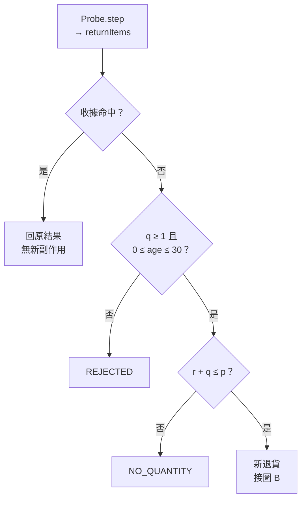
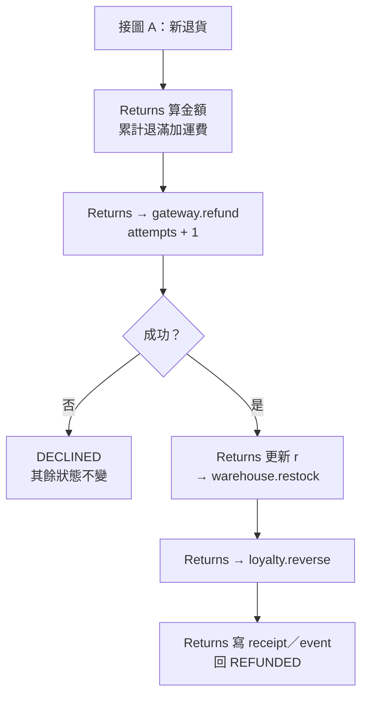
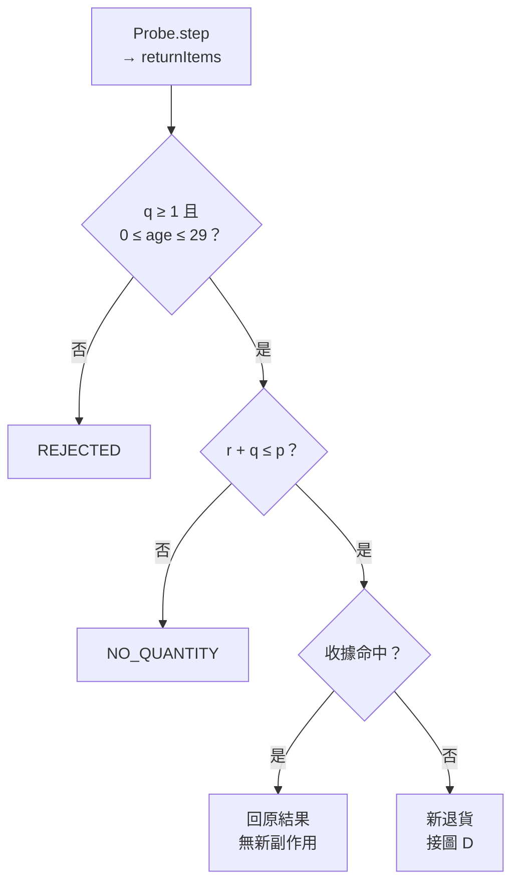
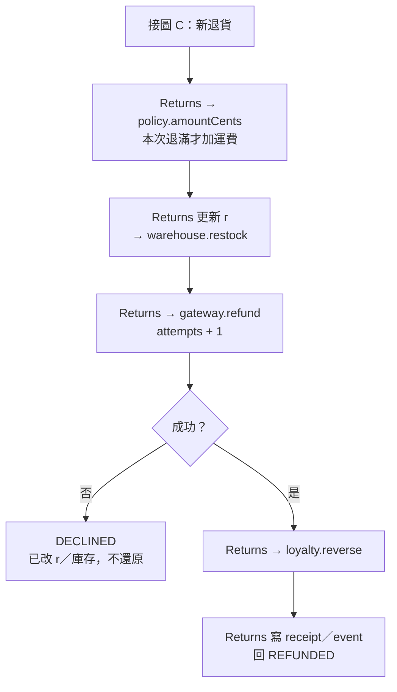

# 程式碼審查：S3 部分退貨公式抽取

## 1. 基本說明

- **建議：Request changes（要求修改）。** 本輪約定審查已完成；需求符合性與約定行為一致性均為 **FAIL**。四項新增阻擋缺陷尚未解除，必要證據缺口為零。
- **現在先做：** 依 [F-001 至 F-004](#4-審查結果與問題) 修正累計退貨運費公式、期限上界與操作順序，再重跑同一組九欄觀測；第四章提供整合修法，尚未套用或驗證。
- **專案：** [simple-skills](/Users/kengp3/Workspaces/mine/simple-skills)；審查來源為 [S3 保留快照](/Users/kengp3/Workspaces/mine/simple-skills/docs/research/ai-code-review-poc-20260928-evidence/s3)，不是此專案其他工作樹變更。
- **本次實際開始時間：** 2026-09-28 14:33:02，Asia/Taipei（UTC+08:00；06:33:02Z）。
- **R2 排版修訂：** 2026-09-28，僅拆分流程圖、縮短標籤並更新呈現依據；沿用上述原開始時間及 R1 Java 觀測，未重跑 Java。R2 圖形渲染由父任務驗收。
- **目的：** 按 [SPEC.md 第 3–23 行](/Users/kengp3/Workspaces/mine/simple-skills/docs/research/ai-code-review-poc-20260928-evidence/s3/head/SPEC.md:3) 驗證退款公式抽取為 `ReturnPolicy` 後，`Returns.returnItems` 的既有契約及必要副作用仍成立。
- **重要限制：** 這是無遠端操作的模擬 PR。原 disposable Git repo／build 已刪除，R1 原始審查直接核對保留的 base／head 快照，於新暫存目錄編譯執行；本次 R2 沿用該觀測；不宣稱重新驗證歷史 Git 物件。真實金流、持久化、並行與 broker 明確不在契約範圍。沒有對平台送出 review。

## 2. 範圍說明

### 版本及比較語意

| 項目 | 固定來源／值 |
| --- | --- |
| branch（原紀錄） | `codex/refund-policy-extraction` |
| base commit（原紀錄） | `9caa46534059dba58d4d8a6ab0da4068a71012ef` |
| head commit（原紀錄） | `568ca825086b400391e73d955bcc3d83e639b9a5` |
| 本輪可直接驗證的來源 | [base 目錄](/Users/kengp3/Workspaces/mine/simple-skills/docs/research/ai-code-review-poc-20260928-evidence/s3/base)、[head 目錄](/Users/kengp3/Workspaces/mine/simple-skills/docs/research/ai-code-review-poc-20260928-evidence/s3/head)，各檔 SHA-256 已對 [manifest](/Users/kengp3/Workspaces/mine/simple-skills/docs/research/ai-code-review-poc-20260928-evidence/s3/manifest.json) 核對 |
| 比較語意 | **直接快照比較**；不是 merge-base、三點 diff 或目前 simple-skills HEAD 的 PR diff |
| 差異 | 2 個 Java 檔、2 個 hunk：新增 `ReturnPolicy.java` 6 行；`Returns.java` 的 1 個 hunk，含 5 行新增與 5 行刪除 |

依 [provenance](/Users/kengp3/Workspaces/mine/simple-skills/docs/research/ai-code-review-poc-20260928-evidence/s3/provenance.txt)，歷史 build 不再存在；歷史 commit 僅用來識別原記錄。保留快照有 17 個檔案（base 8、head 9），所有內容均已讀取；關聯未改內容為兩版的 `Order`、`Warehouse`、`RefundGateway`、`Loyalty`、`ReturnEvent`、`Probe` 及 `SPEC.md`。已以完整文字重新生成直接 patch，與 [diff.patch](/Users/kengp3/Workspaces/mine/simple-skills/docs/research/ai-code-review-poc-20260928-evidence/s3/diff.patch) 逐字相同；manifest 所列 22 檔全部符合。完整責任對帳見 [最後一節](#附錄完整檔案清單)。

原始審查未讀父層規劃、其他情境或歷史 review 報告；本次 R2 僅以本情境 R1 報告進行呈現修訂；未改 snapshots／Skill、未提交／推送、未執行外部服務。未將範圍外整合能力編成待解除的必要缺口。

## 3. 關聯與流程

### 全目標責任與影響分析

| 目標／區塊 | 目的 → 前後實際行為 | 入口／資料與副作用 | 影響及邊界 |
| --- | --- | --- | --- |
| 新增 `ReturnPolicy.amountCents(Order,int)`，1–6 行 | 抽取公式；舊版判斷「累計退滿 3 件」，新版判斷「本次退 3 件」 | 唯一 caller 為 `Returns.returnItems` 第 17 行；讀取同一 `Order` 的單價／購買數／運費；不直接寫狀態 | 分批最後一次少算運費，金額一路傳到 gateway、result、receipt、event；F-001 |
| `Returns` 第 10 行初始化及第 17 行委派 | 每個 service 增加無狀態 policy；委派取代 inline 公式 | `Probe.main` 每案建立一個 service；`step` 是此 fixture 唯一入口 caller | 無額外外部資源／生命週期副作用；公式參數仍是更新前的 Order |
| `Returns` 第 14 行期限 | 原先 `>30` 改為 `>=30` | 合法新請求在任何退款操作前被拒絕 | 第 30 天漏受理；F-002 |
| `Returns` 第 18–20 行順序 | 原先 gateway 成功後更新退貨與庫存；新版在 gateway 前更新 | 影響 `Order.returnedQty`、`Warehouse.restockedQty`；後面的點數、receipt、event 仍位於成功路徑 | decline 無 rollback，重試再加一次；F-003 |
| `Returns` 第 14–16 行 guard／receipt 順序 | 原先 receipt 命中先回放；新版先驗 eligibility／剩餘數 | `LinkedHashMap` 保留成功結果；同 key／同 quantity，age 可前進 | 全退後或期限後重播被拒；F-004。並非重複退款，副作用並未再發生 |

### 控制流程

本次有兩種需要分開判斷的順序變更：**何時允許回放／接受新退貨**（F-002、F-004），以及**退款與庫存何者先更新**（F-001、F-003）。因此將原同畫布的兩版長圖拆為四張上下排列的獨立流程圖：每版先看入口檢查，再接同版副作用圖。使用短標籤與換行，以降低整圖縮放後文字難辨的風險；一般寬度下的可讀性仍由父任務實際驗收。

所有操作由 `Returns.returnItems` 協調；箭頭表示方法內順序，標成 `Returns → X` 才表示它呼叫 collaborator，不表示 collaborators 互相呼叫。短名 `q = quantity`、`r = order.returnedQty`、`p = order.purchasedQty`、`age = ageDays`；「收據」是 `receipts` 中同 key 的成功結果。

#### 圖 A：base 入口與拒絕出口

此圖回答舊版為何能先回放收據，再檢查新請求；只有新退貨能進入圖 B。來源：[base Returns 第 12–17 行](/Users/kengp3/Workspaces/mine/simple-skills/docs/research/ai-code-review-poc-20260928-evidence/s3/base/Returns.java:12)。



#### 圖 B：base 退款與成功副作用

此圖回答舊版在 gateway 拒絕時為何不改退貨／庫存；入口僅來自圖 A 的新退貨出口。來源：[base Returns 第 16–25 行](/Users/kengp3/Workspaces/mine/simple-skills/docs/research/ai-code-review-poc-20260928-evidence/s3/base/Returns.java:16)。



#### 圖 C：head 入口與拒絕出口

此圖回答新版的日期／剩餘數 guard 為何會先攔下重播，以及第 30 天如何被排除（F-002、F-004）；只有通過兩個 guard 且收據未命中的新退貨接圖 D。來源：[head Returns 第 13–17 行](/Users/kengp3/Workspaces/mine/simple-skills/docs/research/ai-code-review-poc-20260928-evidence/s3/head/Returns.java:13)。



#### 圖 D：head 退款與提前寫入

此圖回答新版從 policy 取得金額後，為何在退款拒絕前已更新退貨與庫存（F-001、F-003）；入口僅來自圖 C 的新退貨出口。來源：[head Returns 第 17–25 行](/Users/kengp3/Workspaces/mine/simple-skills/docs/research/ai-code-review-poc-20260928-evidence/s3/head/Returns.java:17)、[policy 第 2–5 行](/Users/kengp3/Workspaces/mine/simple-skills/docs/research/ai-code-review-poc-20260928-evidence/s3/head/ReturnPolicy.java:2)。



四圖均為**來源推導**。退款金額的完整公式、receipt／event 的內容與點數換算保留於第四章原碼及觀測表；[gateway 第 3–8 行](/Users/kengp3/Workspaces/mine/simple-skills/docs/research/ai-code-review-poc-20260928-evidence/s3/head/RefundGateway.java:3) 成功時會增加 `successfulRefunds` 與 `refundedCents`，拒絕僅增加 attempts。實跑只於 `Probe.step` 結束觀測狀態，沒有逐條方法 trace，因此不將圖稱為執行追蹤。

本次作者已核對圖內來源、時序、guard、副作用及正常／拒絕／失敗出口，**未自行執行 R2 圖形渲染**；父任務將按一般報告寬度與正常縮放驗收節點／分支文字。此處不預先宣稱視覺驗收通過。

## 4. 審查結果與問題

F 表示已確認缺陷；四項均為本次新增、`open`，不是既有風格問題。Q（待釐清）與 U（必要證據缺口）均為零。契約明確要求重構保持行為，以下阻擋依具體契約及觀測決定，沒有採用自訂嚴重度分數門檻。

| ID／狀態 | 問題與影響 | 是否阻擋／規則 | 推薦方案 | 專屬解除條件 |
| --- | --- | --- | --- | --- |
| [F-001](#f-001分批退滿時漏退運費)／open | 分批退滿少退 100 cents；receipt／event 金額也錯 | 是；SPEC 10–15 行 | policy 用更新前累計數判斷退滿 | 1 件後再退 2 件，末次 900 cents，累計 1300 cents |
| [F-002](#f-002第-30-天的合法新退貨被拒)／open | 第 30 天遭 REJECTED | 是；SPEC 6–7 行 | 上界改回 `ageDays > 30` | day30 成功退 400 cents，day31 仍拒絕 |
| [F-003](#f-003退款拒絕後退貨數與庫存已增加)／open | 金流失敗卻計入退貨、補庫存；重試重複累加 | 是；SPEC 11–15 行 | 退款成功後才改 Order／Warehouse | decline 僅 attempts 變動；重試成功後退貨與庫存均為 1 |
| [F-004](#f-004成功收據重播被可變-guard-攔截)／open | 全退後重播回 NO_QUANTITY；逾期重播回 REJECTED | 是；SPEC 8–9、16–18 行 | 先查成功 receipt 再驗可變條件 | 兩種 replay 均回原結果且所有副作用不變 |

### F-001：分批退滿時漏退運費

**位置：** [head ReturnPolicy.java 第 1–6 行](/Users/kengp3/Workspaces/mine/simple-skills/docs/research/ai-code-review-poc-20260928-evidence/s3/head/ReturnPolicy.java:1)，`ReturnPolicy.amountCents(Order order, int quantity)`；關鍵是第 4 行只比較本次数量。原始碼如下：

```java
final class ReturnPolicy {
    int amountCents(Order order, int quantity) {
        return quantity * order.unitCents
            + (quantity == order.purchasedQty ? order.shippingCents : 0);
    }
}
```

金額來源是 [head Order.java 第 1–6 行](/Users/kengp3/Workspaces/mine/simple-skills/docs/research/ai-code-review-poc-20260928-evidence/s3/head/Order.java:1)，`returnedQty` 初值為 Java instance `int` 預設零：

```java
final class Order {
    final int purchasedQty = 3;
    final int unitCents = 400;
    final int shippingCents = 100;
    int returnedQty;
}
```

**建議修改：** 替換 policy 第 3–4 行；下列為未套用／未驗證的修改建議。caller 必須維持在增加 `returnedQty` 之前計算，後述整合修法已保留此順序。

```java
return quantity * order.unitCents
    + (order.returnedQty + quantity == order.purchasedQty
        ? order.shippingCents : 0); // 以本次完成後的累計數判斷運費
```

完整資料流見 [head Returns 第 6–26 行](/Users/kengp3/Workspaces/mine/simple-skills/docs/research/ai-code-review-poc-20260928-evidence/s3/head/Returns.java:6) 的原樣摘錄；此片段也作為 F-002、F-003、F-004 的共用上下文，包含容器初值、guard、金額來源與消費端，未省略可推翻結論的程式：

```java
    final Order order = new Order();
    final Warehouse warehouse = new Warehouse();
    final RefundGateway gateway = new RefundGateway();
    final Loyalty loyalty = new Loyalty();
    final ReturnPolicy policy = new ReturnPolicy();
    final Map<String,String> receipts = new LinkedHashMap<>();
    final List<ReturnEvent> events = new ArrayList<>();
    String returnItems(String key, int quantity, int ageDays, boolean decline) {
        if (quantity < 1 || ageDays < 0 || ageDays >= 30) return "REJECTED";
        if (order.returnedQty + quantity > order.purchasedQty) return "NO_QUANTITY";
        if (receipts.containsKey(key)) return receipts.get(key);
        int amountCents = policy.amountCents(order, quantity);
        order.returnedQty += quantity;
        warehouse.restock(quantity);
        if (!gateway.refund(amountCents, decline)) return "DECLINED";
        loyalty.reverse(quantity * order.unitCents / 100);
        String result = "REFUNDED:" + amountCents;
        receipts.put(key, result);
        events.add(new ReturnEvent(key, quantity, amountCents));
        return result;
    }
```

**觸發及觀測：** 初始 3 件、單價 400 cents、運費 100 cents；在第 15 天先用 key `a` 退 1 件，再用 key `b` 退 2 件，兩次 gateway 均成功。第二次應退 900 cents，新版實退 800 cents；累計 `refundedCents` 從應有 1300 變成 1200，第二筆 event 的 `amountCents` 從 900 變成 800，receipt result 也為 `REFUNDED:800`。本案及其餘七案的欄位與步驟比較保留於 [本輪原始證據](/Users/kengp3/Workspaces/mine/simple-skills/docs/research/ai-code-review-poc-20260928-evidence/s3-review-r1.json) 的 `comparison_by_case.partial_final` 及 `runs`。

**反證查核：** caller 在 policy 執行前尚未更新 Order，因此傳入的 `returnedQty=1` 可用；remaining guard 允許再退 2 件。`RefundGateway` 直接累加收到的金額，`ReturnEvent` 原樣存值；沒有其他補退運費責任。這是抽取公式時遺失既有欄位的新增回歸，不是需求變更。

**影響／解除：** 對符合契約的分批退貨少退款，屬金額正確性阻擋；修後需驗末次 result／event 為 900、累計退款為 1300，並維持一次性全退 3 件為 1300。共同重審要求見本章末。

### F-002：第 30 天的合法新退貨被拒

**位置：** [head Returns.java 第 13–14 行](/Users/kengp3/Workspaces/mine/simple-skills/docs/research/ai-code-review-poc-20260928-evidence/s3/head/Returns.java:13)，`Returns.returnItems(String,int,int,boolean)`。完整方法及容器見 F-001 共用原碼；直接出錯的原始 guard 為：

```java
        if (quantity < 1 || ageDays < 0 || ageDays >= 30) return "REJECTED";
```

**建議修改：** 第 14 行改回以下 guard，放在成功 receipt 檢查之後（順序同時配合 F-004）；未套用／未驗證：

```java
if (quantity < 1 || ageDays < 0 || ageDays > 30) return "REJECTED";
```

**觸發及觀測：** fresh service，以 `key=a, quantity=1, ageDays=30, decline=false` 呼叫。規格應成功退款 400 cents、退貨／庫存各加 1、退款 attempts／success 各 1、點數沖回 4，寫入 receipt 與 event。新版回 `REJECTED`，所有數值維持零、receipt／event 為空；base 完成上述預期。九欄差異均在 `comparison_by_case.day30`。

**反證查核：** `Probe` 直接把 30 傳到此方法，沒有上游日期轉換；SPEC 明列 0..30 inclusive。base 的 `>30` 已符合規格，因此不存在核准縮短為 29 天的依據。

**影響／解除：** 合法期限內請求被拒，屬功能阻擋。day30 必須通過，同時保留 `after_window` 的 day31 拒絕與無副作用；quantity／負 age 的原有拒絕條件不得移除。

### F-003：退款拒絕後退貨數與庫存已增加

**位置：** [head Returns.java 第 17–21 行](/Users/kengp3/Workspaces/mine/simple-skills/docs/research/ai-code-review-poc-20260928-evidence/s3/head/Returns.java:17)，同一 `returnItems`。原始碼（完整 guard／初始化及後續 receipt／event 已列 F-001）：

```java
        int amountCents = policy.amountCents(order, quantity);
        order.returnedQty += quantity;
        warehouse.restock(quantity);
        if (!gateway.refund(amountCents, decline)) return "DECLINED";
        loyalty.reverse(quantity * order.unitCents / 100);
```

相關副作用是 [Warehouse 第 1–4 行](/Users/kengp3/Workspaces/mine/simple-skills/docs/research/ai-code-review-poc-20260928-evidence/s3/head/Warehouse.java:1) 直接累加：

```java
final class Warehouse {
    int restockedQty;
    void restock(int quantity) { restockedQty += quantity; }
}
```

[RefundGateway 第 1–10 行](/Users/kengp3/Workspaces/mine/simple-skills/docs/research/ai-code-review-poc-20260928-evidence/s3/head/RefundGateway.java:1) 的拒絕只回 `false`；不會還原 Order／Warehouse：

```java
final class RefundGateway {
    int attempts, successfulRefunds, refundedCents;
    boolean refund(int amountCents, boolean decline) {
        attempts++;
        if (decline) return false;
        successfulRefunds++;
        refundedCents += amountCents;
        return true;
    }
}
```

**建議修改：** 在既有 amount 計算之後、`order.returnedQty += quantity` 之前呼叫退款；替換原第 18–20 行為以下順序，保留之後 loyalty／receipt／event 成功路徑。未套用／未驗證：

```java
if (!gateway.refund(amountCents, decline)) return "DECLINED";
order.returnedQty += quantity;
warehouse.restock(quantity);
```

**觸發及觀測：** fresh service，第 10 天以 key `a` 退 1 件，先 `decline=true`，再以同 key／quantity、`decline=false` 重試：

| 步驟 | 契約／base | head 實測 |
| --- | --- | --- |
| 第一次 DECLINED | attempts=1；returnedQty=0、restockedQty=0 | attempts=1；returnedQty=1、restockedQty=1 |
| 同 key 再成功 | attempts=2、successfulRefunds=1；returnedQty=1、restockedQty=1 | attempts=2、successfulRefunds=1；returnedQty=2、restockedQty=2 |

兩版在第一步皆沒有成功退款、點數沖回、receipt 或 event，第二步皆退款 400 cents、沖回 4 點、記錄一筆 receipt／event。因此錯誤不能只檢查 `result` 或成功次數；同一次商品退貨已讓新版庫存加兩件。

**反證查核：** 只有 `Returns` 修改 `order.returnedQty`；warehouse 是直接累加，退款 false 路徑立刻 return，沒有補償、transaction wrapper 或 finally。SPEC 排除真實金流／持久化，這裡無需假設隱藏的 DB transaction；本輪觀測是具體的記憶體狀態破壞。

**影響／解除：** 失敗請求吃掉剩餘可退數並錯增庫存，屬業務狀態阻擋。decline 後除了 attempts，所有九欄涵蓋的狀態必須不變；重試只累加一次。修法保留 gateway 自身 attempts 記帳。

### F-004：成功收據重播被可變 guard 攔截

**位置：** [head Returns.java 第 13–17 行](/Users/kengp3/Workspaces/mine/simple-skills/docs/research/ai-code-review-poc-20260928-evidence/s3/head/Returns.java:13)，同一 `returnItems`；原始順序如下，receipt 容器初值見 F-001：

```java
    String returnItems(String key, int quantity, int ageDays, boolean decline) {
        if (quantity < 1 || ageDays < 0 || ageDays >= 30) return "REJECTED";
        if (order.returnedQty + quantity > order.purchasedQty) return "NO_QUANTITY";
        if (receipts.containsKey(key)) return receipts.get(key);
        int amountCents = policy.amountCents(order, quantity);
```

**建議修改：** 把成功 receipt 命中放回方法第一個判斷；第 14 行日期修正與 F-002 同時套用。未套用／未驗證：

```java
if (receipts.containsKey(key)) return receipts.get(key);
if (quantity < 1 || ageDays < 0 || ageDays > 30) return "REJECTED";
if (order.returnedQty + quantity > order.purchasedQty) return "NO_QUANTITY";
```

**觸發及觀測：** 同根因的兩個可達案例合併為一項：

| 初始操作 → 相同請求重播 | 規格／base 回傳 | head 回傳 |
| --- | --- | --- |
| 第 10 天 key `a` 成功退 3 件 → 同 key、3 件、第 10 天再呼叫 | `REFUNDED:1300` | `NO_QUANTITY`；3+3 超過 3，尚未查 receipt 就返回 |
| 第 10 天 key `a` 成功退 1 件 → 同 key、1 件、第 31 天再呼叫 | `REFUNDED:400` | `REJECTED`；年齡 guard 先返回 |

兩種 replay 其餘八欄均維持第一步成功後的值，沒有額外退款或 event。缺陷是破壞成功結果的冪等回放，不能誇大為已實測重複金流。

**反證查核：** SPEC 明確允許 age 隨重播前進，且同 key 數量相同；兩案皆符合，不以「請求不同」排除。成功後 receipts 確實保存結果，沒有 expiry／清除程式。剩餘數或年齡是可變狀態，不能代替已完成收據判斷。

**影響／解除：** 客戶重試失去原成功回覆，違反明定 replay 契約，屬阻擋。兩種 replay 必須回原字串，九欄中的狀態、金額、attempts、receiptKeys 及 event 內容均不能增加或改變。

### 整合修法與共同重審要求

上述修改作用於同一方法，請以此順序整合：先修 policy 的累計公式（F-001），再用下列方法替換 head `Returns.returnItems` 第 13–26 行（F-002、F-003、F-004）。所有 class／API 均存在於快照；這是**建議程式碼，未套用、未編譯驗證**，不代表 finding 已解除：

```java
String returnItems(String key, int quantity, int ageDays, boolean decline) {
    if (receipts.containsKey(key)) return receipts.get(key);
    if (quantity < 1 || ageDays < 0 || ageDays > 30) return "REJECTED";
    if (order.returnedQty + quantity > order.purchasedQty) return "NO_QUANTITY";
    int amountCents = policy.amountCents(order, quantity);
    if (!gateway.refund(amountCents, decline)) return "DECLINED";
    order.returnedQty += quantity;
    warehouse.restock(quantity);
    loyalty.reverse(quantity * order.unitCents / 100);
    String result = "REFUNDED:" + amountCents;
    receipts.put(key, result);
    events.add(new ReturnEvent(key, quantity, amountCents));
    return result;
}
```

重審固定修後來源／SPEC／Probe hash，在新的 build 目錄重編；完整重跑八案、每版十二步，逐一對帳九欄及各 finding 的專屬解除條件。保留原始 stdout／stderr／exit code，不能僅以所有 Java 程序 exit 0 結案。修後程式、測試或規格若改動，重新判定證據適用性。

### 已查面向與結果

| 面向／範圍 | 方法及證據 | 結果／邊界 |
| --- | --- | --- |
| 功能／契約 | SPEC 逐條映射完整方法與八案十二步 | F-001～F-004；三案完全一致並符合規格，五案不符 |
| 數值及資料傳遞 | 固定 3 件、400 cents、100 cents；追 policy→gateway→result／receipt／event | 新增金額錯誤為 F-001；有限案例不能推廣為任意 int 範圍皆安全 |
| 信任邊界／安全 | 核對非空 ASCII key、同 key 同 quantity 的明定前提與入口 guard；沒有 SQL、網路或身份入口 | 未發現本次新增注入／授權路徑；不宣稱一般公開網路 API 安全 |
| 可靠性／失敗副作用 | 完整 false 分支、所有共享物件欄位寫入及 retry 觀測 | F-003；真實交易／外部故障不在範圍 |
| 冪等／相容性 | 回傳字串、receipt、可變 eligibility guard 的先後 | F-002、F-004；方法簽名未改，行為契約破壞 |
| 並行／非同步 | 無 executor／thread，SPEC 明確單一 service、逐步操作 | 不適用；不以此證明 thread safety |
| 效能／資源 | 每次多一個無狀態 policy 呼叫，每個 service 一個 policy；無新增 loop／I/O／依賴 | 無具體新增效能阻擋；未跑 benchmark，非必要 |
| 設計／維護 | 抽取責任、唯一 caller、所有受影響方法及未改 collaborators | 抽取本身合理；需保留累計資料與副作用順序，不要求新增抽象或 dependency |
| 測試有效性 | Probe 只打印、不 assert；本輪解析 JSON，比較九欄且對照 SPEC | 全部 exit 0 但仍抓到五案差異；正常、拒絕、失敗、重播均有可觀測證據 |
| Java 特性 | package-private 方法可由同 default package 的 Probe 呼叫；無 overload／繼承 dispatch／DI／transaction proxy／serializer 設定 | SPEC 稱公開行為是驗收用語，不誤稱方法宣告為 `public`；不推定快照外 callers |

## 5. 結論

對本輪固定 S3 head 保留快照建議 **Request changes**；審查執行完成，需求符合性及要求保留的行為均為 **FAIL**。F-001、F-002、F-003、F-004 均維持 open，沒有必要 U 缺口，也沒有修改程式或遠端 PR 狀態。

下一步依第四章整合修法修正後，固定新快照並重跑完整八案九欄；只有各缺陷專屬解除條件及共同重審要求成立，才能將對應 finding 標為 verified。現有原始結果足以證明本次阻擋，但不宣稱真實金流、任意輸入或全 repo 正確。

## 附錄：證據與查核依據

### 原審查執行與沿用觀測

[R1 原始執行紀錄](/Users/kengp3/Workspaces/mine/simple-skills/docs/research/ai-code-review-poc-20260928-evidence/s3-review-r1.json) 保存完整實際 argv、cwd、exit code、原始 stdout／stderr、解析後觀測、九欄逐步差異、manifest 核對結果及工具版本。Java／javac 為 Temurin OpenJDK 25.0.1，Python 3.14.7；未宣稱 Java 8 相容性。R1 當時的新暫存 build 根目錄：`/var/folders/76/hd61cw513zbdlr0y7_h27dx80000gn/T/s3-review-r1-ki_64d4w`。

實際命令逐檔展開保留於 JSON `runs.<base|head>.compile.argv`；下列僅為可讀性表示的同型命令，不冒稱記錄中的 argv 使用 shell glob：

```sh
javac -d <new-build>/base <retained-base Java files>
javac -d <new-build>/head <retained-head Java files>
java -cp <new-build>/<base|head> Probe <case>
```

兩次 compile 均 exit 0；十六次 Probe 程序均 exit 0，stdout 共二十四筆逐步 JSON，stderr 皆空。每版各八案、十二步；以 `result`、`returnedQty`、`restockedQty`、`refundAttempts`、`successfulRefunds`、`refundedCents`、`reversedPoints`、`receiptKeys`、`events` 全部九欄比較。這是 R1 審查於 2026-09-28 執行的觀測（紀錄時間為 14:34:23.305637 +08:00）；R2 排版修訂未重跑。原觀測逐筆等於 [原 execution.json](/Users/kengp3/Workspaces/mine/simple-skills/docs/research/ai-code-review-poc-20260928-evidence/s3/execution.json) 的觀測；原檔中 raw stdout 與 observed 也逐筆相等。

| Probe 案例／輸入摘要 | 步數／版 | head 對契約 | 本輪觀測 |
| --- | --- | --- | --- |
| partial_final：a/1 件、b/2 件，age=15，均成功 | 2 | FAIL | 末次少退 100 cents；F-001 |
| day30：a/1 件，age=30，成功設定 | 1 | FAIL | 九欄均與預期不同；F-002 |
| decline_retry：a/1 件，age=10，拒絕→成功 | 2 | FAIL | 兩步的 returnedQty／restockedQty 多 1；F-003 |
| replay_full：a/3 件，age=10，成功→重播 | 2 | FAIL | 第二步 result 不符，其餘八欄不變；F-004 |
| replay_expired：a/1 件，age=10 成功→age=31 重播 | 2 | FAIL | 第二步 result 不符，其餘八欄不變；F-004 |
| too_many：a/4 件，age=10 | 1 | PASS（本案例） | NO_QUANTITY，數值全零、receiptKeys／events 空 |
| after_window：a/1 件，age=31 | 1 | PASS（本案例） | REJECTED，數值全零、receiptKeys／events 空 |
| normal：a/1 件，age=10 | 1 | PASS（本案例） | REFUNDED:400；退貨／庫存各 1、attempt／success 各 1、退款 400、點數 4、一筆 receipt／event |

`Probe` 使用模擬 class，並未觸發真實金流或 broker；全部八案可涵蓋本輪已列缺陷，但不保證窮盡任何未列輸入／排程。

### 固定依據與交付查核

本次 R2 呈現修訂依 [Skill R2 report.md](/Users/kengp3/Workspaces/mine/simple-skills/docs/research/ai-code-review-poc-20260928-evidence/skill-r2/references/report.md) 的獨立上下分圖與一般報告寬度驗收規則。父任務回報 R1 圖自然寬度約 6665px，縮至約 1048px 時文字難辨，並提供 [R1 渲染截圖](/Users/kengp3/Workspaces/mine/simple-skills/docs/research/ai-code-review-poc-20260928-evidence/s3-r1-diagram.png)；此為父任務觀測，本作者未獨立重測該尺寸。R2 保留四個 finding、所有原始碼摘錄、完整輸入／觀測／修法及結論，僅替換第三章圖文並記錄證據沿用。

原始審查採用 [Skill R1](/Users/kengp3/Workspaces/mine/simple-skills/docs/research/ai-code-review-poc-20260928-evidence/skill-r1/SKILL.md)、[deep-review.md](/Users/kengp3/Workspaces/mine/simple-skills/docs/research/ai-code-review-poc-20260928-evidence/skill-r1/references/deep-review.md)、[report.md](/Users/kengp3/Workspaces/mine/simple-skills/docs/research/ai-code-review-poc-20260928-evidence/skill-r1/references/report.md)、[專案文件規則](/Users/kengp3/Workspaces/mine/simple-skills/project-setting.md) 及使用者本輪 AGENTS 指示。已檢查目的地及下層指示：未存在實體 root／docs／docs/research AGENTS.md，也未找到 docs 下適用 AGENTS／project-setting；文件目的地位於確認的專案內，父目錄無越界 symlink。精確模型版本未取得，記為未知。

[相鄰 SHA-256 核對索引](/Users/kengp3/Workspaces/mine/simple-skills/docs/research/ai-code-review-poc-s3-r2-hashes-20260928.research.md) 集中列原始 snapshots、patch、規格／runner、原紀錄、manifest、provenance、Skill／references／hash checker、project-setting、本輪 raw evidence 及本報告；完整 hash 不在正文重貼。R2 以 [Skill R2 hash checker](/Users/kengp3/Workspaces/mine/simple-skills/docs/research/ai-code-review-poc-20260928-evidence/skill-r2/scripts/check_report_hashes.py) 核對該索引；exit 0，`checked 34 linked SHA-256 values`。原 generation 紀錄只作來源鏈材料，未重跑被刪除的生成環境或讀取其生成器腳本，亦不將歷史 generation exit 0 當 review 通過。

已回讀五章順序、首頁與待辦、四個原碼位置／片段、觀測、建議碼與解除條件、圖的版本／guard／時序、完整清單及本機連結；原程式審查沒有新增必要缺口。未執行修法，R2 圖形渲染仍交父任務驗收，未提前宣告視覺通過。

## 附錄：完整檔案清單

### 所有 diff 目標

| 狀態／舊 → 新路徑 | class／方法或責任 | 差異作用／影響 | 分析狀態／證據／問題 |
| --- | --- | --- | --- |
| A：無 → [head/ReturnPolicy.java](/Users/kengp3/Workspaces/mine/simple-skills/docs/research/ai-code-review-poc-20260928-evidence/s3/head/ReturnPolicy.java:1) | `ReturnPolicy.amountCents(Order,int)`，完整 1–6 行 | 新增公式抽取；累計運費條件丟失 | 全文已讀、唯一 caller 已查；F-001，partial_final |
| M：[base/Returns.java](/Users/kengp3/Workspaces/mine/simple-skills/docs/research/ai-code-review-poc-20260928-evidence/s3/base/Returns.java:1) → [head/Returns.java](/Users/kengp3/Workspaces/mine/simple-skills/docs/research/ai-code-review-poc-20260928-evidence/s3/head/Returns.java:1) | `Returns` 初始化、`returnItems(String,int,int,boolean)` | 唯一 hunk：policy 初始化／呼叫、日期 guard、receipt 順序、退款與退貨／庫存順序；成功後點數／收據／事件保持 | 兩版全文與所有改動已查；F-001～F-004、完整八案 |

### 關聯但未修改的來源

| base／head 路徑 | 責任與查核 | 狀態 |
| --- | --- | --- |
| [base/Order.java](/Users/kengp3/Workspaces/mine/simple-skills/docs/research/ai-code-review-poc-20260928-evidence/s3/base/Order.java)、[head/Order.java](/Users/kengp3/Workspaces/mine/simple-skills/docs/research/ai-code-review-poc-20260928-evidence/s3/head/Order.java) | 固定購買 3 件、單價 400、運費 100 cents；returnedQty 初值零及累計狀態 | 兩版全文相同已查；F-001、F-003 |
| [base/Warehouse.java](/Users/kengp3/Workspaces/mine/simple-skills/docs/research/ai-code-review-poc-20260928-evidence/s3/base/Warehouse.java)、[head/Warehouse.java](/Users/kengp3/Workspaces/mine/simple-skills/docs/research/ai-code-review-poc-20260928-evidence/s3/head/Warehouse.java) | restock 直接加總，無還原機制 | 兩版全文相同已查；F-003 |
| [base/RefundGateway.java](/Users/kengp3/Workspaces/mine/simple-skills/docs/research/ai-code-review-poc-20260928-evidence/s3/base/RefundGateway.java)、[head/RefundGateway.java](/Users/kengp3/Workspaces/mine/simple-skills/docs/research/ai-code-review-poc-20260928-evidence/s3/head/RefundGateway.java) | 每次 attempts 加一，decline false-return；成功更新次數與 cents | 兩版全文相同已查；F-001、F-003 |
| [base/Loyalty.java](/Users/kengp3/Workspaces/mine/simple-skills/docs/research/ai-code-review-poc-20260928-evidence/s3/base/Loyalty.java)、[head/Loyalty.java](/Users/kengp3/Workspaces/mine/simple-skills/docs/research/ai-code-review-poc-20260928-evidence/s3/head/Loyalty.java) | 點數直接累加；Returns 的成功路徑才呼叫 | 兩版全文相同已查；全八案核對 reversedPoints |
| [base/ReturnEvent.java](/Users/kengp3/Workspaces/mine/simple-skills/docs/research/ai-code-review-poc-20260928-evidence/s3/base/ReturnEvent.java)、[head/ReturnEvent.java](/Users/kengp3/Workspaces/mine/simple-skills/docs/research/ai-code-review-poc-20260928-evidence/s3/head/ReturnEvent.java) | 原樣保留 key、quantity、amountCents；toString 輸出觀測 JSON | 兩版全文相同已查；F-001 與成功／拒絕／replay 的事件數及內容 |
| [base/Probe.java](/Users/kengp3/Workspaces/mine/simple-skills/docs/research/ai-code-review-poc-20260928-evidence/s3/base/Probe.java)、[head/Probe.java](/Users/kengp3/Workspaces/mine/simple-skills/docs/research/ai-code-review-poc-20260928-evidence/s3/head/Probe.java) | 唯一可見 caller；每案新 service；八案輸入、九欄 JSON stdout | 兩版全文相同已查且執行全部步驟；沒有內建 assertion，不以 exit 0 判規格 |
| [base/SPEC.md](/Users/kengp3/Workspaces/mine/simple-skills/docs/research/ai-code-review-poc-20260928-evidence/s3/base/SPEC.md)、[head/SPEC.md](/Users/kengp3/Workspaces/mine/simple-skills/docs/research/ai-code-review-poc-20260928-evidence/s3/head/SPEC.md) | 重構契約、輸入前提、失敗／成功／重播、副作用與八案驗證要求 | 兩版全文相同已查；判斷基準，不以實作當規格 |

### 證據材料與排除對帳

| 路徑／類型 | 查核或排除狀態 |
| --- | --- |
| [diff.patch](/Users/kengp3/Workspaces/mine/simple-skills/docs/research/ai-code-review-poc-20260928-evidence/s3/diff.patch)、[manifest.json](/Users/kengp3/Workspaces/mine/simple-skills/docs/research/ai-code-review-poc-20260928-evidence/s3/manifest.json) | 全部 patch 已讀並重建相同；manifest 22 檔 hash 全數有效 |
| [execution.json](/Users/kengp3/Workspaces/mine/simple-skills/docs/research/ai-code-review-poc-20260928-evidence/s3/execution.json) | 原 compile／八案逐步 raw／observed／版本／file hashes 已核對；R1 使用新 build 重跑；R2 未重跑 |
| [environment.json](/Users/kengp3/Workspaces/mine/simple-skills/docs/research/ai-code-review-poc-20260928-evidence/s3/environment.json)、[generation.json](/Users/kengp3/Workspaces/mine/simple-skills/docs/research/ai-code-review-poc-20260928-evidence/s3/generation.json)、[provenance.txt](/Users/kengp3/Workspaces/mine/simple-skills/docs/research/ai-code-review-poc-20260928-evidence/s3/provenance.txt) | 已讀來源鏈及刪除限制；generation 只作原紀錄，不執行原 generator |
| [R1 s3-review-r1.json](/Users/kengp3/Workspaces/mine/simple-skills/docs/research/ai-code-review-poc-20260928-evidence/s3-review-r1.json) | R1 產生並於 R2 沿用的實跑證據，非被審變更；完整命令、退出碼、raw stdout／stderr 保留 |
| 原 disposable Git repo／build dirs | provenance 明示已移除；未讀取，不假稱重查 commit／merge-base。直接快照審查已由本次任務明定 |
| 生成／二進位 diff | 無；新編譯 class 僅放本輪暫存目錄，不當成原 committed diff |
| 未讀取 diff 目標／工具失敗 | 無；其他情境、父層 plans／歷史 reports 及全 repo 故意排除，非未完成必要項 |
