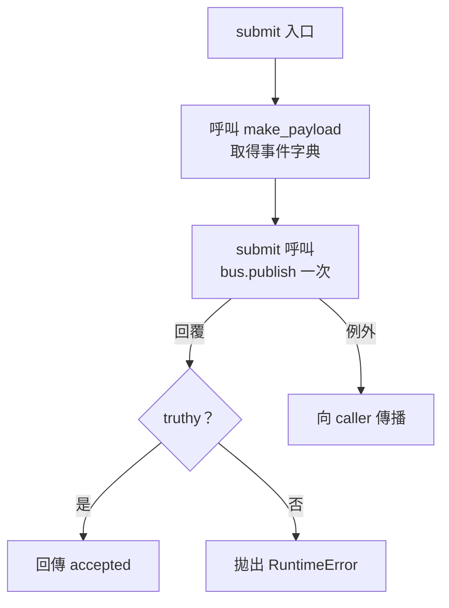

# s4：publisher extraction 審查

## 1. 基本說明

- **建議：Hold（暫緩）；執行狀態：部分完成。** 已完成來源審查及本機成功／拒絕案例，未完成合約要求的真實 transport 重啟持久性驗收；整體需求符合性為 UNKNOWN。
- 尚存事項：0 項已確認缺陷、0 項非阻擋建議、1 項必要證據缺口（U 代表必要證據缺口）：[U-001](#u-001真實-transport-重啟持久性紀錄缺漏)。未發現需要 Request changes 的來源缺陷。
- 現在先做：補上實際 transport adapter／設定版本與整合執行紀錄，證明 acknowledgement 前資料已持久保存且能跨程序重啟恢復。現有離線材料無法產生這項證據，亦未授權部署。
- 專案：simple-skills；完整路徑：[專案根目錄](/Users/kengp3/Workspaces/mine/simple-skills)。
- 審查目標：[s4 固定快照](/Users/kengp3/Workspaces/mine/simple-skills/docs/research/ai-code-review-poc-20260928-evidence/s4)，目的為確認 payload 抽取後保留 `submit` 行為及滿足明訂驗收義務。
- 實際開始時間：2026-09-28 14:33:14 +08:00（Asia/Taipei；工具回傳 06:33:14 UTC）。模型精確版本未知。
- 排版修訂：2026-09-28 14:43:01 +08:00。r2 僅調整圖表呈現；保留上述原審查開始時間及 r1 觀測，未重跑業務 Python。
- 範圍入口：[範圍說明](#2-範圍說明)、[完整檔案清單](#附錄完整檔案清單)。本報告是離線演練建議，未提交平台 review，未查核平台合併規則。

## 2. 範圍說明

| 項目 | 固定來源與比較方式 |
|---|---|
| base | [base/publisher.py](/Users/kengp3/Workspaces/mine/simple-skills/docs/research/ai-code-review-poc-20260928-evidence/s4/base/publisher.py)，由 manifest 內容雜湊固定 |
| head | [head/publisher.py](/Users/kengp3/Workspaces/mine/simple-skills/docs/research/ai-code-review-poc-20260928-evidence/s4/head/publisher.py)，由 manifest 內容雜湊固定 |
| 比較 | 直接快照比較；非 Git branch／commit，因此無 branch 名、commit 或 merge-base 可聲稱 |
| 變更 | 1 個 Python 檔案、1 個差異區塊；新增 4 行、刪除 2 行；無生成／二進位／配置變更 |
| 驗收依據 | [contract.json](/Users/kengp3/Workspaces/mine/simple-skills/docs/research/ai-code-review-poc-20260928-evidence/s4/contract.json)：單次發布指定 payload、truthy acknowledgement 才接受、否則 RuntimeError，以及來源、本機案例、真實持久 transport 紀錄 |

已讀取 base／head 完整函式、全部 patch、唯一提供的 caller `probe.py`、FakeBus、合約、manifest 與既有 execution.json。重新產生 unified diff 與提供 patch 相符，manifest 六項 hash 全部吻合；完整值集中在[核對索引](/Users/kengp3/Workspaces/mine/simple-skills/docs/research/ai-code-review-poc-s4-r2-hashes-20260928.research.md)。

先盤點變更責任，再檢查所有受影響路徑：新增 `make_payload(order_id)` 回傳事件字典；`submit` 原先在本地建構該字典，現在於 publish 參數中呼叫 helper；剩餘 guard 與回傳不變。關聯但未改的 probe 負責提供 fake publish 回覆與收集呼叫資料。讀取了目前工作樹狀態，既有其他變更未納入且未修改。原審查未讀其他 scenario、過往報告或父任務計畫；本次排版修訂僅沿用本報告 r1。

真實 adapter／endpoint／整合 log 未提供，因其屬合約必要驗收，列 U-001；其他未提供業務 caller 屬來源邊界，不另造待辦。`order_id` 為上游已驗證的非空字串是合約前提，本次未實測上游驗證。

## 3. 關聯與流程

本次抽取僅改變 payload 建構責任；新舊都建立新字典、發布一次，依回覆真值決定接受或拒絕。兩版 guard 與出口相同，因此只畫 head 的直向流程，保留成功、拒絕及 publish 例外出口；base 的差異是 `submit` 直接建立 payload，head 改呼叫 `make_payload` 取得相同字典。這張來源推導圖回答「submit 何時發布、哪些條件決定結果」，避免重複兩版相同分支。



固定來源：[base submit](/Users/kengp3/Workspaces/mine/simple-skills/docs/research/ai-code-review-poc-20260928-evidence/s4/base/publisher.py:1)、[head helper 與 submit](/Users/kengp3/Workspaces/mine/simple-skills/docs/research/ai-code-review-poc-20260928-evidence/s4/head/publisher.py:1)、[probe 與 FakeBus](/Users/kengp3/Workspaces/mine/simple-skills/docs/research/ai-code-review-poc-20260928-evidence/s4/probe.py:1)。入口是 probe 呼叫 `submit(bus, order_id)`；事件字典包含 `type="OrderAccepted"` 與原 `order_id`。helper 回傳字典給 submit，並不直接呼叫 publish。

**證據界線：** 這是來源推導的控制流程，不是整合執行追蹤。真假 acknowledgement 分支沿用 r1 本機觀測，publish 例外傳播為來源推導；FakeBus 僅將 payload append 到記憶體 list，故圖中 publish 不表示已持久提交，U-001 維持 open。r1 圖已由主審渲染並發現文字縮小難辨，本次改為單版短標籤直向圖；r2 尚待主審以一般報告寬度及正常縮放做渲染驗收。

## 4. 審查結果與問題

| ID／狀態 | 問題與影響 | 是否阻擋／理由 | 推薦方案 | 解除條件 |
|---|---|---|---|---|
| [U-001](#u-001真實-transport-重啟持久性紀錄缺漏)／open | 無法確認程序重啟後資料仍存在，以及持久保存先於 acknowledgement | 阻止 Approve；合約明訂必要證據欠缺，並非已確認程式缺陷 | 補同版實際 adapter／設定與具關聯 ID 的整合紀錄 | 能核對本次 head、payload、提交／重啟／恢復／acknowledgement 時序，且符合合約 |

### U-001：真實 transport 重啟持久性紀錄缺漏

相關位置：[head submit 第 4–7 行](/Users/kengp3/Workspaces/mine/simple-skills/docs/research/ai-code-review-poc-20260928-evidence/s4/head/publisher.py:4)；缺證依據：[合約 requirements](/Users/kengp3/Workspaces/mine/simple-skills/docs/research/ai-code-review-poc-20260928-evidence/s4/contract.json:3)及[FakeBus 第 3–9 行](/Users/kengp3/Workspaces/mine/simple-skills/docs/research/ai-code-review-poc-20260928-evidence/s4/probe.py:3)。以下為相關原碼，**不是缺陷碼**：

```python
def submit(bus, order_id):
    if not bus.publish(make_payload(order_id)):
        raise RuntimeError("publish rejected")
    return "accepted"
```

具體案例：`order_id="o-1"`、FakeBus 回傳 `True`，操作 `submit(bus, "o-1")` 後，實際觀測是記憶體 list 有一筆 `{"type":"OrderAccepted","order_id":"o-1"}` 並回傳 `accepted`。本機結果符合呼叫與回傳要求，但必要持久性預期為 acknowledgement 前已保存資料，且資料可跨程序重啟恢復；現有案例沒有 transport 儲存或重啟觀測，該部分結果未知，不能說它失敗，也不能說它通過。

反證查核：FakeBus 第 8 行只有 `self.calls.append(payload)`，第 9 行直接回傳預設 acknowledge；既有 execution.json 與本輪重跑皆呼叫此 fake，無磁碟、broker 或實際 adapter 證據。合約明確指出這些材料不可取得，因此本機成功不足以解除缺口。責任人待指派。

**推薦補證，不要求無根據改碼。** adapter API 與設定不可得，無法可靠提供實作修補。提供對應本次來源的 adapter／設定版本及整合原始 log；至少使用非空訂單 ID 發布一筆事件，以同一 correlation ID 記錄 durable write、被測程序停止／重啟、恢復讀取同一 type/order_id，以及 acknowledgement 時點，證明 acknowledgment 所代表的持久承諾確實成立。紀錄應包含執行命令、環境、時間、退出碼與失敗輸出；由有權操作整合環境的人執行，本輪未部署或操作外部服務。

補證合格後核對版本及上述時序再重審；不得以 fake 的額外測試取代真實 transport 紀錄。

### 已查面向與判斷

| 面向 | 方法與證據 | 結果／邊界 |
|---|---|---|
| 功能／重構一致性 | 全文比對 helper 與 submit；base/head 各跑 True／False 一次 | payload type/order_id、單次呼叫、accepted、RuntimeError 訊息皆一致；本機範圍 PASS |
| 邊界與 guard | 檢查 `if not` 在兩版保留 | 都採 truthiness，而非僅等於 True；其他 truthy/falsy 型別未額外實跑，來源語意無變更 |
| 安全與信任 | 對照非空字串前提與資料流 | 僅傳遞 order_id，無 eval、命令或查詢組合；不將上游驗證未提供冒充本次新增缺陷 |
| 可靠性／副作用 | 查所有 publish caller、guard、例外路徑及 FakeBus | 每次 submit 呼叫 publish 一次，無新增重試；publish 例外自然向上傳播且與舊版一致；durability 為 U-001 |
| 並行／效能 | 查完整 5／7 行模組及 fake | 無新增共享狀態、執行緒或迴圈；每次新建固定兩欄字典及新增一次 helper 呼叫，未發現值得量測的新增資源風險 |
| 設計／相容性 | 核對 submit 簽名、payload schema、錯誤與回傳 | 輸入與輸出契約保留；make_payload 為局部責任抽取，無需提出風格修正 |
| 測試有效性 | probe 原本只列印；本輪 runner 對解析 JSON 的完整預期陣列作 assert | 兩版各兩案例，exit 0、stderr 空；斷言檢查呼叫次數與完整 payload，非只看 exit code；不證明真實提交 |

已主動排除「未在 submit 重複檢查空 order_id」作為 finding，因合約已限定上游有效輸入；亦未將 FakeBus 無持久性誤報為本次抽取引入的缺陷。所有差異區塊已對帳，必要整合步驟仍未完成。

## 5. 結論

**本次固定 head 建議 Hold；執行狀態部分完成，整體需求符合性 UNKNOWN。** 已完成來源品質審查及新舊本機行為比對，未發現確定來源缺陷，本機成功與拒絕案例通過。唯一未解除事項為 U-001，不能以現有觀測宣告完整驗收或 Approve。

建議流程：先提供對應版本的真實 transport adapter／設定與持久性整合 log；再核對同一事件跨重啟恢復以及提交先於 acknowledgement 的證據；最後維持來源、契約、runner 與設定的版本關聯重新判定 U-001。若證據揭露實作違約，再依實際原因建立 finding；本輪不預設其有 bug。

## 附錄：證據與查核依據

- r2 僅做呈現修訂：依 [skill-r2/SKILL.md](/Users/kengp3/Workspaces/mine/simple-skills/docs/research/ai-code-review-poc-20260928-evidence/skill-r2/SKILL.md) 與 [skill-r2/report.md](/Users/kengp3/Workspaces/mine/simple-skills/docs/research/ai-code-review-poc-20260928-evidence/skill-r2/references/report.md) 的選圖／可讀性規則，改為單版短標籤直向圖，保留分支、錯誤出口及證據界線。[r1 圖表截圖](/Users/kengp3/Workspaces/mine/simple-skills/docs/research/ai-code-review-poc-20260928-evidence/s4-r1-diagram.png) 已讀；原圖寬 3507px 縮至約 1048px 的量測由主審提供，截圖可見文字難辨。以下來源審查與執行紀錄皆沿用 r1，未以排版修訂冒稱新執行；r2 視覺驗收由主審進行。
- 原來源審查使用技能：[指定 skill-r1/SKILL.md](/Users/kengp3/Workspaces/mine/simple-skills/docs/research/ai-code-review-poc-20260928-evidence/skill-r1/SKILL.md)；依序讀取 [deep-review.md](/Users/kengp3/Workspaces/mine/simple-skills/docs/research/ai-code-review-poc-20260928-evidence/skill-r1/references/deep-review.md) 與 [report.md](/Users/kengp3/Workspaces/mine/simple-skills/docs/research/ai-code-review-poc-20260928-evidence/skill-r1/references/report.md)。專案文件規則為 [project-setting.md](/Users/kengp3/Workspaces/mine/simple-skills/project-setting.md)；亦遵守工作階段提供的 AGENTS 指示。目標各層未找到額外 AGENTS.md。未使用記憶或未提供的歷史結論。
- 輸入原始執行時間為 2026-09-28 14:31:49.568592 +08:00；r1 於 14:34:03 +08:00 重跑，非僅沿用輸入既有 pass；r2 沿用此觀測。r1 環境 Python 3.14.7，原始命令、環境、stdout、stderr、exit code、manifest／patch 核對均存於 [s4-review-r1.json](/Users/kengp3/Workspaces/mine/simple-skills/docs/research/ai-code-review-poc-20260928-evidence/s4-review-r1.json)。
- 重跑命令：工作目錄為 s4，依次以 `PYTHONPATH=<s4>/base`、`PYTHONPATH=<s4>/head` 執行 `/opt/homebrew/opt/python@3.14/bin/python3.14 -B <s4>/probe.py`；兩次退出碼皆 0。外層 Python runner 解析兩行 JSON 並 assert 完整 rows 等於成功與拒絕的預期 dict 陣列，assert 命令退出碼 0。
- 兩版相同 stdout 原樣如下；stderr 均空：

```json
{"acknowledge": true, "calls": [{"type": "OrderAccepted", "order_id": "o-1"}], "result": "accepted"}
{"acknowledge": false, "calls": [{"type": "OrderAccepted", "order_id": "o-1"}], "error": "publish rejected"}
```

- 使用 hashlib 核對 manifest 六項，用 difflib.unified_diff 重建 patch 並 assert 相符；所有斷言通過。固定 hash 及所有採用檔案集中在 [核對索引](/Users/kengp3/Workspaces/mine/simple-skills/docs/research/ai-code-review-poc-s4-r2-hashes-20260928.research.md)，r2 索引以 skill-r2 的 `scripts/check_report_hashes.py` 實際核對。
- 完成後回讀五章、首頁決策、U-001 補證條件、來源摘錄、流程箭頭與末端清單，確認 Hold／部分完成／UNKNOWN 一致，未把 fake 成功誤寫成 durable delivery。r1 圖表後續渲染暴露可讀性問題；r2 的原始碼與來源對應已核對，仍待主審渲染驗收。

## 附錄：完整檔案清單

| 狀態／舊→新路徑 | 方法／責任 | 差異作用與影響 | 分析狀態 |
|---|---|---|---|
| M：[base/publisher.py](/Users/kengp3/Workspaces/mine/simple-skills/docs/research/ai-code-review-poc-20260928-evidence/s4/base/publisher.py) → [head/publisher.py](/Users/kengp3/Workspaces/mine/simple-skills/docs/research/ai-code-review-poc-20260928-evidence/s4/head/publisher.py) | base submit 1–5 行；head make_payload 1–2 行、submit 4–7 行 | 唯一 hunk 抽取兩欄 payload 建構，將 publish 參數改成 helper 回傳；單次 publish、guard 與結果保留 | 完整來源／差異已查；本機 PASS；transport U-001 |

關聯但未修改的來源與證據：

| 路徑 | 責任與查閱狀態 |
|---|---|
| [contract.json](/Users/kengp3/Workspaces/mine/simple-skills/docs/research/ai-code-review-poc-20260928-evidence/s4/contract.json) | 全文已讀，定義呼叫行為與必要持久性驗收，U-001 依據 |
| [probe.py](/Users/kengp3/Workspaces/mine/simple-skills/docs/research/ai-code-review-poc-20260928-evidence/s4/probe.py) | 全文已讀且兩版重跑；FakeBus 與唯一提供的 submit caller；未驗證實際 transport |
| [execution.json](/Users/kengp3/Workspaces/mine/simple-skills/docs/research/ai-code-review-poc-20260928-evidence/s4/execution.json) | 原始本機兩案例輸出已核對；不是本輪執行或整合 log |
| [diff.patch](/Users/kengp3/Workspaces/mine/simple-skills/docs/research/ai-code-review-poc-20260928-evidence/s4/diff.patch) | 唯一 hunk 已逐行分析，重建相符 |
| [manifest.json](/Users/kengp3/Workspaces/mine/simple-skills/docs/research/ai-code-review-poc-20260928-evidence/s4/manifest.json) | 六項輸入 hash 皆相符，未更動 |
| 實際 transport adapter／endpoint／integration log | 未提供，必要驗收尚未查核，U-001；未以範圍排除方式解除 |

未有其他差異檔案、生成檔或二進位檔；本報告不宣稱審查完整 repo 或未提供的來源。
