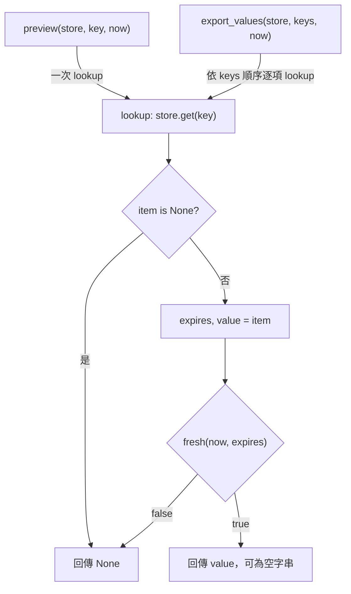

# S5 code review：快取有效性政策抽取

## 1. 基本說明

- **建議：Request changes（要求修改）**。候選 snapshot 在到期當下仍回傳過期值，違反明定契約；這是本機演練建議，沒有提交平台 review。
- **尚存事項：1 個已確認阻擋 F-001，0 個必要證據缺口 U、0 個待釐清 Q**。見[問題與解除條件](#f-001)。第一步：將 `fresh` 的 `<=` 改回 `<`，再重跑兩個 caller 的到期邊界。
- **執行狀態：來源審查與約定案例重跑完成；需求符合性 FAIL；約定行為一致性 FAIL**。Mermaid 尚未實際渲染，圖形可讀性由父代理另行驗收，不能把原始碼核對視為視覺驗證。
- 專案：simple-skills，完整路徑 [simple-skills](/Users/kengp3/Workspaces/mine/simple-skills)。受審範圍僅為 [S5 snapshot 資料包](/Users/kengp3/Workspaces/mine/simple-skills/docs/research/ai-code-review-poc-forward-20260928-evidence/s5)。
- 日期時間：2026-09-28，Asia/Taipei（UTC+08:00）；開始讀取規則時未記錄精確秒數，本輪首次時間紀錄為 **14:44:05+08:00**；重跑精確時間見[本輪原始紀錄](/Users/kengp3/Workspaces/mine/simple-skills/docs/research/ai-code-review-poc-forward-20260928-evidence/s5-review-r2.json:3)。
- 目的：檢查政策抽取是否保留 `lookup`、`preview`、`export_values` 行為，並重跑契約指定的到期前／當下／後、缺值及空字串案例。

## 2. 範圍說明

| 項目 | 固定來源／判斷 |
|---|---|
| Base | [base/cache.py](/Users/kengp3/Workspaces/mine/simple-skills/docs/research/ai-code-review-poc-forward-20260928-evidence/s5/base/cache.py:1)、[base/views.py](/Users/kengp3/Workspaces/mine/simple-skills/docs/research/ai-code-review-poc-forward-20260928-evidence/s5/base/views.py:1)；branch、commit 未提供，不冒稱 Git ref |
| Head | [head/cache.py](/Users/kengp3/Workspaces/mine/simple-skills/docs/research/ai-code-review-poc-forward-20260928-evidence/s5/head/cache.py:1)、[head/policy.py](/Users/kengp3/Workspaces/mine/simple-skills/docs/research/ai-code-review-poc-forward-20260928-evidence/s5/head/policy.py:1)、[head/views.py](/Users/kengp3/Workspaces/mine/simple-skills/docs/research/ai-code-review-poc-forward-20260928-evidence/s5/head/views.py:1)；branch、commit 未提供 |
| 比較語意 | **直接 snapshot 比較**，不用 merge-base；由兩側全部檔案重新產生 unified diff，與 [diff.patch](/Users/kengp3/Workspaces/mine/simple-skills/docs/research/ai-code-review-poc-forward-20260928-evidence/s5/diff.patch:1) 逐字一致 |
| 差異目標 | 2 個 Python 檔案、2 個差異區塊：`cache.py` 修改，`policy.py` 新增；`views.py` 完全相同，作 caller 關聯來源全讀 |
| 固定性 | [manifest](/Users/kengp3/Workspaces/mine/simple-skills/docs/research/ai-code-review-poc-forward-20260928-evidence/s5/manifest.json:1) 所列 9 個輸入檔案全部通過 SHA-256 核對，重跑前後不變；具體值集中於[核對索引](/Users/kengp3/Workspaces/mine/simple-skills/docs/research/s5-r2-hashes-20260928.research.md) |
| 規格 | [contract.json](/Users/kengp3/Workspaces/mine/simple-skills/docs/research/ai-code-review-poc-forward-20260928-evidence/s5/contract.json:3)：整數 ticks 來自同一時鐘；value 為字串，可為空；僅 `now < expires` 有效；缺值及過期回傳 `None`；export 保留輸入順序及所有 fresh 值 |
| 執行與邊界 | 單執行緒本機函式；無需真實時鐘、外部系統或整合測試。排除實際 working tree、其他情境、plans、reports、generator、遠端及平台規則 |

完整方法、全部 caller、guard、輸出過濾、probe 及既有 execution 均已讀取；沒有缺檔、截斷、生成檔或二進位差異。[最後完整檔案清單](#附錄完整檔案清單) 列明差異責任及所有關聯證據。

## 3. 關聯與流程

本次新增 `policy.fresh(now, expires)`，把 `lookup` 內的有效性運算委派出去；字串值、缺值 guard 與兩個 caller 皆維持原結構。真正行為差異是 `<` 變成 `<=`。`preview` 直接轉交單一 lookup；`export_values` 依 `keys` 順序逐項 lookup，僅排除 `None`，所以空字串必須保留。兩個入口都沒有第二層到期防護。

因為本次風險是共用判斷分支傳到兩個 caller，使用一張函式關係／流程圖說明入口、guard、政策及回傳分支；不需要類別圖或並行圖。**圖為來源推導，並非逐步執行追蹤**；重跑只觀測方法結果，未 instrumentation 中間步驟。拓樸相同，圖呈現 head，base 的 policy 判斷位於 `lookup` 本體且為 `<`。



來源：[head/cache.py 第 1–8 行](/Users/kengp3/Workspaces/mine/simple-skills/docs/research/ai-code-review-poc-forward-20260928-evidence/s5/head/cache.py:1)、[head/policy.py 第 1–2 行](/Users/kengp3/Workspaces/mine/simple-skills/docs/research/ai-code-review-poc-forward-20260928-evidence/s5/head/policy.py:1)、[head/views.py 第 1–7 行](/Users/kengp3/Workspaces/mine/simple-skills/docs/research/ai-code-review-poc-forward-20260928-evidence/s5/head/views.py:1)。圖的兩種 return 均返回呼叫者；`preview` 原樣回傳，`export_values` 收集非 `None` 值。`fresh` 在 head 使用 `now <= expires`，因此到期當下走 true；F-001 由此影響兩個出口。圖未渲染，尚無實際寬度、縮放及標籤可讀性證據。

## 4. 審查結果與問題

F 表示已確認缺陷、U 表示必要證據缺口、Q 表示待釐清事項；本輪只有 F-001，沒有把範圍外真實時鐘或部署資料列為缺口。

| ID／狀態 | 問題與具體影響 | 阻擋理由 | 推薦方案 | 解除條件 |
|---|---|---|---|---|
| [F-001](#f-001)／open | 到期當下仍顯示並匯出過期字串，含空字串 | 是：違反明定排除 expires 的邊界，破壞重構行為保留 | 在共用 `fresh` 將 `<=` 改為 `<` | 固定新 head；兩 caller 及 lookup 的 9、10、11 ticks、缺值、空值與順序案例全部符合契約；來源與新證據 hash 一致 |

### F-001

**到期當下仍判 fresh，preview 與 export 輸出過期值（本次新增回歸；open）。** 影響為契約明定的到期邊界失效，不推定成敏感資訊外洩或真實秒數延遲；ticks 是呼叫端整數。沒有團隊嚴重度級別可沿用，不虛構 P 等級門檻。阻擋理由來自契約本身。

根因位置：head 的 [policy.py 第 1–2 行](/Users/kengp3/Workspaces/mine/simple-skills/docs/research/ai-code-review-poc-forward-20260928-evidence/s5/head/policy.py:1)，函式 `fresh(now, expires)`（契約參數均為 integer ticks）；問題運算在第 2 行。原始程式完整如下：

```python
def fresh(now, expires):
    return now <= expires
```

傳值與 guard：head 的 [cache.py 第 1–8 行](/Users/kengp3/Workspaces/mine/simple-skills/docs/research/ai-code-review-poc-forward-20260928-evidence/s5/head/cache.py:1)，`lookup(store, key, now)`，原樣完整摘錄：

```python
from policy import fresh

def lookup(store, key, now):
    item = store.get(key)
    if item is None:
        return None
    expires, value = item
    return value if fresh(now, expires) else None
```

受影響 caller：head 的 [views.py 第 1–7 行](/Users/kengp3/Workspaces/mine/simple-skills/docs/research/ai-code-review-poc-forward-20260928-evidence/s5/head/views.py:1)，`preview(store, key, now)` 與 `export_values(store, keys, now)`，兩者均未修改；原樣完整摘錄：

```python
from cache import lookup

def preview(store, key, now):
    return lookup(store, key, now)

def export_values(store, keys, now):
    return [value for key in keys if (value := lookup(store, key, now)) is not None]
```

**建議修改：替換 `head/policy.py` 第 2 行；未套用、未執行驗證的建議碼。** 在共同責任點修正，使所有 caller 一致；保留缺值 guard 與 `is not None` 過濾，不在 caller 疊加判斷。

```diff
 def fresh(now, expires):
-    return now <= expires
+    return now < expires
```

**實際觀測及具體案例。** 初始化 `store = {"a": (10, "A"), "empty": (10, "")}`，以 `now = 10` 呼叫 preview 與 export；`keys = ["missing", "a", "empty"]`。預期所有 entry 已到期。見 [probe 原始案例](/Users/kengp3/Workspaces/mine/simple-skills/docs/research/ai-code-review-poc-forward-20260928-evidence/s5/probe.py:3) 與[本輪 raw JSON](/Users/kengp3/Workspaces/mine/simple-skills/docs/research/ai-code-review-poc-forward-20260928-evidence/s5-review-r2.json)。

| 操作／輸入 | 契約預期及 base 實測 | head 實測 |
|---|---|---|
| `preview(store, "a", 10)` | `None` | `"A"` |
| `preview(store, "empty", 10)` | `None` | `""` |
| `preview(store, "missing", 10)` | `None` | `None` |
| `export_values(store, ["missing", "a", "empty"], 10)` | `[]` | `["A", ""]` |

到期前 `now=9` 兩版皆顯示 `"A"`、`""`，export 為 `["A", ""]`；到期後 `now=11` 兩版皆回 `None`／`[]`。獨立補充案例直接呼叫 lookup，並將 export keys 改為 `["empty", "missing", "a", "empty"]`：到期前兩版輸出 `["", "A", ""]`，證實空值、順序與重複 key 保留；到期當下 head 仍保留這三個過期值，base 為 `[]`。

**可達性與反證。** 契約明列 `now == expires` 為必要案例，不能視作不合法輸入；lookup 的前置 guard 僅攔截 item 缺失，時間有效性完全委派給 fresh；preview 沒有 guard；export 的 `is not None` 只排除 lookup 回傳的 `None`。已讀取本資料包全部 caller，沒有能消除相等邊界的額外檢查。空字串並非假陽性：規格明定 fresh 時應被保留，問題只在過期後仍保留。Base 的 `<` 與本輪實測共同支持這是抽取政策後新增的回歸。

**解除方式。** 修正共用 predicate 後，固定新 snapshot 並重跑同一 probe 與 raw JSON 保存的 supplemental source；所有 expected rows 應通過，特別是 `now=10` 的非空及空字串均不得輸出。重新核對新來源、契約、runner 與原始輸出 hash；未取得新執行證據前保持 open，不以建議碼或作者聲稱修好結案。

### 已查面向與結果

| 面向 | 方法與證據 | 結果／適用邊界 |
|---|---|---|
| 功能／契約 | 完整讀兩版共 5 個來源檔，重建 diff；兩 caller 跑 9／10／11、missing／empty；額外直接 lookup | 確認 F-001；其他已跑案例符合契約 |
| 安全／信任邊界 | 追 store、key、now 至 get、比較與回傳；契約限定字串與整數 | 無動態執行、外部 I/O、授權或敏感 sink；未提供的不合法型別不擴充成阻擋 |
| 可靠性／副作用 | 來源中只有 dict get、純比較及新 list 收集 | 無持久化、事件、提交、交易、重試或資源生命週期；無需真實提交證據 |
| 並行／順序 | 契約明確 single-threaded；export comprehension 沿 keys 順序；補充反向與重複 keys | 並行不適用；順序及空值保留實測通過，到期篩選受 F-001 影響 |
| 效能／資源 | lookup 新增一次常數時間函式呼叫；export 每個 key 呼叫一次 | 未新增無界工作或容器；未量測效能，不宣稱 benchmark 通過 |
| 設計／相容性 | 三個函式 signature 保留；新增 import 在各自 PYTHONPATH 下成功載入；caller 無改動 | 抽取責任可理解；僅確認所給 snapshot 的模組組合，不推定套件部署 |
| 測試有效性 | probe 無 assertion，僅印輸出；本輪以 contract 推導 expected rows，另補 lookup 與不同 keys 次序 | 所有程序 exit 0 只代表執行成功；head 在到期當下的比較為 false，不能將 exit 0 當功能 PASS |

## 5. 結論

對固定 S5 head 的演練建議為 **Request changes**：已完成完整差異／caller 來源審查與約定本機案例重跑，需求及行為保留均為 FAIL；唯一尚存阻擋是 F-001。沒有必要業務證據缺口，無須額外真實時鐘或外部整合。

建議流程：修正共用 `fresh` 的相等邊界 → 固定新 snapshot → 重跑兩 caller 與補充 lookup／順序案例並核對 hash → 依新證據重審 F-001。另由父代理完成圖形視覺驗收；目前不宣稱圖形已渲染。本報告沒有修改被審程式、建立 PR 或執行遠端動作。

## 附錄：證據與查核依據

- 採用 [SKILL.md](/Users/kengp3/Workspaces/mine/simple-skills/docs/research/ai-code-review-poc-forward-20260928-evidence/skill-r2/SKILL.md)、[deep-review.md](/Users/kengp3/Workspaces/mine/simple-skills/docs/research/ai-code-review-poc-forward-20260928-evidence/skill-r2/references/deep-review.md)、[report.md](/Users/kengp3/Workspaces/mine/simple-skills/docs/research/ai-code-review-poc-forward-20260928-evidence/skill-r2/references/report.md) 與[專案文件規範](/Users/kengp3/Workspaces/mine/simple-skills/project-setting.md)。未使用 snapshot Git helper、migration 規則、其他 scenario、先前 review 或記憶；模型精確版本未取得。
- 初始盤點即完整讀取 diff、base/head 與契約，先對帳 2 個差異目標，再分析 caller 關係與政策作用，最後核對缺陷及反證。未查 working tree 或 Git 遠端；沒有在缺少 commit 的情況偽造 commit provenance。
- [既有 execution.json](/Users/kengp3/Workspaces/mine/simple-skills/docs/research/ai-code-review-poc-forward-20260928-evidence/s5/execution.json:1) 作參照，**本輪已重新執行**，沒有沿用舊綠燈。原始執行紀錄、argv、cwd、PYTHONPATH、Python／平台版本、exit code、stdout／stderr、預期 rows、逐列比較與前後輸入 hash 均見[本輪 raw JSON](/Users/kengp3/Workspaces/mine/simple-skills/docs/research/ai-code-review-poc-forward-20260928-evidence/s5-review-r2.json)。
- 執行方式：以 Python 標準庫 `tempfile.TemporaryDirectory` 建立暫存 cwd；每個 snapshot 使用獨立 subprocess 及其 PYTHONPATH；`-B` 與 `PYTHONDONTWRITEBYTECODE=1` 禁止來源目錄產生 bytecode；不新增 dependency。完整 argv 存 raw JSON，暫存目錄於結束後刪除。既有 probe 重現命令如下（切換 base/head 分別執行）：

```sh
PYTHONPATH=/Users/kengp3/Workspaces/mine/simple-skills/docs/research/ai-code-review-poc-forward-20260928-evidence/s5/head python3 -B /Users/kengp3/Workspaces/mine/simple-skills/docs/research/ai-code-review-poc-forward-20260928-evidence/s5/probe.py
```

- 共執行 4 個程序（base/head × 原 probe/補充），exit code 均 0、stderr 均空。原 probe 與補充各 3 列觀測；base 各 3/3 符合契約，head 各 2/3 符合，在 now=10 各有 1 列不符合。列內包含多項操作，不把列數冒充測試函式數。
- [核對索引](/Users/kengp3/Workspaces/mine/simple-skills/docs/research/s5-r2-hashes-20260928.research.md) 集中保存來源、規則、工具、報告及 raw JSON 的 SHA-256。交付檢查執行 `python3 <skill-r2>/scripts/check_report_hashes.py <核對索引>`，另核對 manifest 全部 9 個 hash、報告本機連結／行號、原樣摘錄與正文順序。完整值不在正文重複。
- 未渲染圖形；語法及箭頭與來源逐項核對僅屬靜態檢查，不代替父代理的真實瀏覽器驗收。

## 附錄：完整檔案清單

差異目標（全部已讀，無待查區塊）：

| 狀態／舊 → 新路徑 | 符號／責任 | 差異作用／影響 | 分析結果 |
|---|---|---|---|
| M：[base/cache.py](/Users/kengp3/Workspaces/mine/simple-skills/docs/research/ai-code-review-poc-forward-20260928-evidence/s5/base/cache.py:1) → [head/cache.py](/Users/kengp3/Workspaces/mine/simple-skills/docs/research/ai-code-review-poc-forward-20260928-evidence/s5/head/cache.py:1) | `lookup(store, key, now)` | 單一 hunk：新增 policy import，把內嵌 `<` 判斷改為呼叫 fresh；缺值 guard、拆包、value 回傳保留 | 完整方法與所有 caller 已查；傳遞 F-001 到兩 caller |
| A：無 → [head/policy.py](/Users/kengp3/Workspaces/mine/simple-skills/docs/research/ai-code-review-poc-forward-20260928-evidence/s5/head/policy.py:1) | `fresh(now, expires)` | 單一 hunk：新增函式，使用 `<=`；base 無此檔，diff 中 base 路徑僅是新增表示 | 完整已查；F-001 根因，建議 `<` |

關聯但未修改的來源與證據：

| 路徑／狀態 | 責任／採用方式 | 查核結果／邊界 |
|---|---|---|
| [base/views.py](/Users/kengp3/Workspaces/mine/simple-skills/docs/research/ai-code-review-poc-forward-20260928-evidence/s5/base/views.py:1)、[head/views.py](/Users/kengp3/Workspaces/mine/simple-skills/docs/research/ai-code-review-poc-forward-20260928-evidence/s5/head/views.py:1)／內容相同 | preview 直接回傳；export 依順序收集非 None 值 | 完整 7 行已讀、所有 caller 已追；兩入口已重跑 |
| [contract.json](/Users/kengp3/Workspaces/mine/simple-skills/docs/research/ai-code-review-poc-forward-20260928-evidence/s5/contract.json:1)／規格 | 建立有效性、型別、順序、空值及執行界限 | 完整已讀；F-001 規則依據；不更改契約以取得 PASS |
| [diff.patch](/Users/kengp3/Workspaces/mine/simple-skills/docs/research/ai-code-review-poc-forward-20260928-evidence/s5/diff.patch:1)／差異 | 兩檔、兩 hunk 的直接 snapshot 差異 | 從全部快照檔案獨立重建後逐字相同 |
| [manifest.json](/Users/kengp3/Workspaces/mine/simple-skills/docs/research/ai-code-review-poc-forward-20260928-evidence/s5/manifest.json:1)／固定輸入 | 包含 9 個輸入 SHA-256 | 9/9 符合，重跑前後一致 |
| [probe.py](/Users/kengp3/Workspaces/mine/simple-skills/docs/research/ai-code-review-poc-forward-20260928-evidence/s5/probe.py:1)／本機案例 | 到期前／當下／後，preview 非空／空／缺值及 export | 完整 5 行已讀；base/head 各重跑；印出而不自行斷言 |
| [execution.json](/Users/kengp3/Workspaces/mine/simple-skills/docs/research/ai-code-review-poc-forward-20260928-evidence/s5/execution.json:1)／既有輸出 | 先前執行 argv、stdout／stderr | 完整已讀，與本輪觀測一致；不代替本輪重跑 |
| [s5-review-r2.json](/Users/kengp3/Workspaces/mine/simple-skills/docs/research/ai-code-review-poc-forward-20260928-evidence/s5-review-r2.json)／本輪產物 | 新執行結果、補充 source、expected rows、輸入 hashes | 有效本機方法證據；非整合或逐步追蹤 |

本資料包無刪除、改名、二進位、生成或未讀差異目標。Working tree、其他情境、plans、reports、generator 與遠端狀態均依授權邊界排除，未將範圍外資料缺席列為必要 U。
