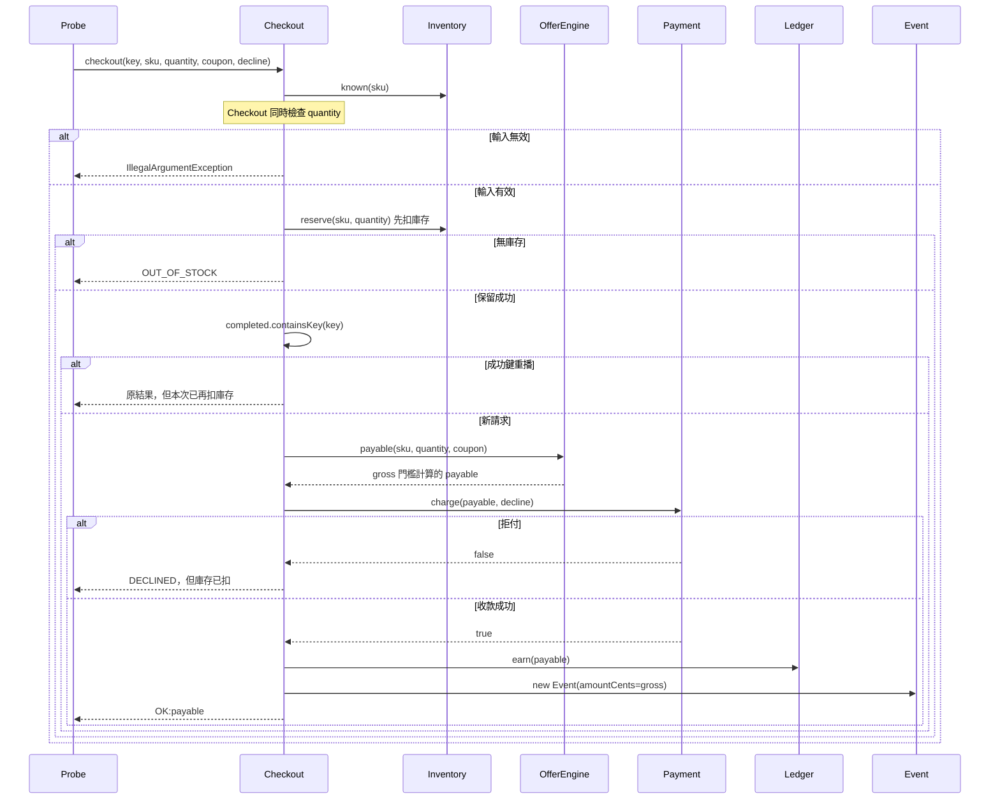

# Marketplace 結帳重構審查

## 1. 基本說明

- **建議：Request changes（要求修改）。** 發現 4 個未解除的業務缺陷；沒有必要證據缺口。
- **現在先做：** 修正優惠門檻與結帳副作用順序，再讓事件金額使用實際收款額；[查看問題與建議碼](#issues)。
- 專案：本機新建的 Java Marketplace 結帳模擬 [原始版本庫](/private/tmp/marketplace-review-20260925-run/repo)；可持續查閱的 [固定來源與執行證據](/Users/kengp3/Workspaces/mine/simple-skills/docs/research/marketplace-review-20260925-evidence)。
- 本次審查時間記錄：2026-09-25 00:28:42 +08:00（Asia/Taipei）。技能與來源的首次閱讀早於此記錄，精確起始秒數未保存。
- 變更目的：抽出優惠計算，同時保留結帳金額、庫存、拒付重試、成功重播、點數及事件契約。
- 執行狀態：本次約定的來源與 8 案例逐步觀測已查核完成；需求符合性 **FAIL**。這是模擬合併請求，沒有遠端 PR 或平台審查動作。

<a id="scope"></a>
## 2. 範圍說明

| 固定版本 | 值 |
|---|---|
| 基準 `main` | `e087829e9e433532bad70e41c2108c349925db1e` |
| 候選 `codex/offer-refactor` | `82fae800e5e506a8abc5b532b5c39ddff5c8f73b` |
| 比較 | `git diff main...codex/offer-refactor`；merge-base 已核對為上述基準提交 |
| 差異 | 2 個 Java 檔案、2 個區塊：[Checkout.java 修改](/Users/kengp3/Workspaces/mine/simple-skills/docs/research/marketplace-review-20260925-evidence/head/Checkout.java)、[OfferEngine.java 新增](/Users/kengp3/Workspaces/mine/simple-skills/docs/research/marketplace-review-20260925-evidence/head/OfferEngine.java)；無刪檔、改名、二進位或配置變更 |

[規格](/Users/kengp3/Workspaces/mine/simple-skills/docs/research/marketplace-review-20260925-evidence/base/SPEC.md)要求每個案例從獨立實例開始：KIT 庫存 2、單價 1200 分；ADDON 庫存 5、單價 350 分。數量至少 3 時先取整打九折，只有**折後金額達 1000 分**才可再扣 150 分優惠券。成功付款後才扣庫存、加點數及發布本地事件；點數為實付金額除以 100 取整。成功請求鍵重播須先於會變動的庫存資格檢查。

已檢查完整兩側 Checkout、未修改但會影響判斷的 Inventory／Payment／Ledger／Event、Probe 案例入口、規格、patch、固定提交及 [逐步執行紀錄](/Users/kengp3/Workspaces/mine/simple-skills/docs/research/marketplace-review-20260925-evidence/execution.json)。[完整檔案清單](#files)在最末。

範圍是同鍵同輸入、循序執行的記憶體內付款替身；真實付款、訊息系統、資料庫、併發、持久化、跨訂單鍵及逾時沒有材料，也非本案例約定驗收項。模擬成功不代表正式環境交易可靠。

## 3. 關聯與流程

變更從 Checkout 內部的價格算式搬到新增的 OfferEngine，同時改動了 Checkout 的庫存保留、快取判斷及事件資料。下表區分責任與影響，圖則專門回答「候選版本在拒付或重播時，哪個副作用先發生」。

| 責任 | 基準 → 候選 | 影響路徑 |
|---|---|---|
| `Checkout.checkout` | 先查成功快取／庫存，算價付款成功後扣庫存 → 先保留庫存，再查快取、付款 | `Probe.step → Checkout → Inventory / Payment / Ledger / Event`；F-002、F-003 |
| `OfferEngine.payable` | 從 Checkout 抽出價格政策；優惠券門檻改讀折扣前 gross | 結帳金額、收款與點數；F-001 |
| `Event` 資料 | 原傳 payable，候選傳 gross；Event 類別本身未變 | 下游看到的事件金額不同於成功收款；F-004 |

因核心風險是跨類別呼叫與失敗順序，採一張 **候選版本循序圖**；基準流程的關鍵差異已在表中列出，圖沒有假設舊系統呼叫新系統。



[查看已渲染循序圖](/Users/kengp3/Workspaces/mine/simple-skills/docs/research/marketplace-review-20260925-evidence/flow.png)。已以本機 Chrome 實際渲染並檢視箭頭、條件分支與文字，圖中付款失敗及重播的庫存先行順序可讀。

這是從 [候選 Checkout 第 12 行](/Users/kengp3/Workspaces/mine/simple-skills/docs/research/marketplace-review-20260925-evidence/head/Checkout.java:12)、[OfferEngine 第 2 行](/Users/kengp3/Workspaces/mine/simple-skills/docs/research/marketplace-review-20260925-evidence/head/OfferEngine.java:2) 與 [Inventory 第 8 行](/Users/kengp3/Workspaces/mine/simple-skills/docs/research/marketplace-review-20260925-evidence/head/Inventory.java:8)推導的控制順序；[執行紀錄](/Users/kengp3/Workspaces/mine/simple-skills/docs/research/marketplace-review-20260925-evidence/execution.json)只提供每一步結束的狀態，並非逐箭頭追蹤。圖省略無變更的序列化細節。

<a id="issues"></a>
## 4. 審查結果與問題

`F` 表示有來源與觀測支持的已確認缺陷；以下四項均由本次候選版本引入，狀態為 open（未解除）。`U` 表示必要證據缺口；本次沒有 U。這四項都違反明文規格，會阻擋本模擬 PR 通過。

| 問題 | 影響 | 建議與解除條件 |
|---|---|---|
| [F-001](#f001) 折扣門檻錯用原價 | ADDON 3 件多扣 150 分，付款及點數偏低 | 門檻用 `afterTier`；邊界案例實付 945 分 |
| [F-002](#f002) 拒付仍扣庫存 | 付款 0 分但庫存減少，重試會再扣 | 付款成功後才保留；拒付後庫存不變 |
| [F-003](#f003) 重播先讀庫存 | 售罄時原成功請求回 `OUT_OF_STOCK`；有貨時重播也會再扣 | 成功快取先於庫存判斷；兩種重播皆無副作用 |
| [F-004](#f004) 事件寫原價 | 成功收 1050 分，事件卻記 1200 分 | 事件傳 `payable`；每筆事件等於當次收款 |

<a id="f001"></a>
### F-001：優惠券門檻用折扣前金額

位置：[OfferEngine.payable(String,int,boolean) 第 5 行](/Users/kengp3/Workspaces/mine/simple-skills/docs/research/marketplace-review-20260925-evidence/head/OfferEngine.java:5)。原始問題碼：

```java
        return afterTier - (coupon && gross >= 1000 ? 150 : 0);
```

建議替換（未套用到受審提交；已在隔離副本驗證）：

```java
// 門檻以分量折扣後的金額判斷。
return afterTier - (coupon && afterTier >= 1000 ? 150 : 0);
```

例：ADDON 單價 350 分，買 3 件、使用優惠券；原價 1050 分，九折後 945 分，因此**不符合** 1000 分門檻。基準與規格應收 945 分、得 9 點；候選錯收 795 分、得 7 點。付款替身實際收 795 分，並非單純顯示錯誤。[coupon_boundary 逐步輸出](/Users/kengp3/Workspaces/mine/simple-skills/docs/research/marketplace-review-20260925-evidence/execution.json)可核對。KIT 1 件可正當用券，無法替 ADDON 邊界案例作反證。解除需在 `coupon_boundary` 與 `mixed` 比對折扣、付款、點數及事件，且 `qualified_coupon` 仍為 1050 分。

<a id="f002"></a>
### F-002：付款拒絕前先扣庫存

位置：[Checkout.checkout(String,String,int,boolean,boolean) 第 15 行](/Users/kengp3/Workspaces/mine/simple-skills/docs/research/marketplace-review-20260925-evidence/head/Checkout.java:15)及[第 18 行](/Users/kengp3/Workspaces/mine/simple-skills/docs/research/marketplace-review-20260925-evidence/head/Checkout.java:18)。兩段原始問題碼分別摘錄，省略的第 16–17 行為快取與算價：

```java
        if (!inventory.reserve(sku, quantity)) return "OUT_OF_STOCK";
```

```java
        if (!payment.charge(payable, decline)) return "DECLINED";
```

建議：先用只讀 `available` 判斷，收款成功後才呼叫 `reserve`；整合修改碼在 F-004 後，並保留原有輸入驗證。例：新訂單 KIT 庫存 2，以鍵 a 購買 1 件且付款拒絕；基準庫存仍 2、收款 0，候選卻剩 1、收款仍 0。接著同鍵重試成功，基準剩 1，候選已剩 0。[decline_retry 逐步輸出](/Users/kengp3/Workspaces/mine/simple-skills/docs/research/marketplace-review-20260925-evidence/execution.json)可核對。`Payment.charge` 拒絕只回 false，沒有呼叫任何庫存回補；`Inventory.reserve` 已立即扣量。解除需拒付步的庫存／點數／事件／快取保持初值，同鍵重試只扣一次庫存。

<a id="f003"></a>
### F-003：成功請求重播排在庫存後

位置：[Checkout.checkout(String,String,int,boolean,boolean) 第 15–16 行](/Users/kengp3/Workspaces/mine/simple-skills/docs/research/marketplace-review-20260925-evidence/head/Checkout.java:15)。原始問題碼：

```java
        if (!inventory.reserve(sku, quantity)) return "OUT_OF_STOCK";
        if (completed.containsKey(key)) return completed.get(key);
```

建議先查成功快取，再查庫存；完整碼在下方。例：KIT 初始庫存 2，a 購買 2 件成功後庫存 0；同鍵重播應再次回 `OK:2400` 且不發新事件或扣量，候選回 `OUT_OF_STOCK`。在 `mixed` 案例中還有 1 件庫存時，重播 a 回原值但庫存又從 1 減到 0，證明只改售罄錯誤訊息不足。[replay_exhausted 與 mixed 逐步輸出](/Users/kengp3/Workspaces/mine/simple-skills/docs/research/marketplace-review-20260925-evidence/execution.json)可核對。`completed` 的確保存了成功鍵，問題是檢查太晚。解除需驗證有貨與售罄兩種重播均回原結果，付款次數、庫存、點數及事件均不再變。

<a id="f004"></a>
### F-004：事件金額使用原價

位置：[Checkout.checkout(String,String,int,boolean,boolean) 第 22–23 行](/Users/kengp3/Workspaces/mine/simple-skills/docs/research/marketplace-review-20260925-evidence/head/Checkout.java:22)。原始問題碼：

```java
        int gross = (sku.equals("KIT") ? 1200 : 350) * quantity;
        events.add(new Event(key, sku, quantity, gross, payable / 100));
```

建議移除重算原價，將事件金額改為實付：

```java
// 事件金額要與當次成功付款一致。
events.add(new Event(key, sku, quantity, payable, payable / 100));
```

例：KIT 1 件使用有效優惠券，原價 1200 分，實付 1050 分；候選付款累計與回覆均為 1050 分，事件 `amountCents` 卻為 1200 分。此案例沒有 F-001 的門檻錯誤，能獨立定位事件資料根因。[qualified_coupon 逐步輸出](/Users/kengp3/Workspaces/mine/simple-skills/docs/research/marketplace-review-20260925-evidence/execution.json)可核對。Event 建構子原樣保存金額，不會轉回實付。解除需所有成功事件的 `amountCents` 等於當次 `Payment.charge` 的 payable，且 `earnedPoints` 對應該金額。

### 整合修正與共同重驗

三項 Checkout 問題相依：先看成功重播、再檢查庫存，付款成功後才扣庫存，最後發正確金額事件。以下替換候選 `Checkout.java` 第 15–23 行；前面的 SKU 與數量 guard 保留。同時套用 F-001 的 OfferEngine 修改。這是具體**建議碼，未套用到受審提交；隔離副本已驗證**：

```java
if (completed.containsKey(key)) return completed.get(key); // 成功重播先行
if (!inventory.available(sku, quantity)) return "OUT_OF_STOCK";
int payable = offers.payable(sku, quantity, coupon);
if (!payment.charge(payable, decline)) return "DECLINED";
inventory.reserve(sku, quantity); // 此模擬僅循序執行；成功才扣庫存
ledger.earn(payable);
String result = "OK:" + payable;
completed.put(key, result);
events.add(new Event(key, sku, quantity, payable, payable / 100));
```

主持者將相同修改套用至隔離副本，1 次編譯及 8 案例／13 步輸出逐筆與基準完全相同；[實際補丁](/Users/kengp3/Workspaces/mine/simple-skills/docs/research/marketplace-review-20260925-evidence/suggested-fix.patch)與[命令及逐步輸出](/Users/kengp3/Workspaces/mine/simple-skills/docs/research/marketplace-review-20260925-evidence/suggested-fix-verification.json)已保存。此驗證支持建議碼在約定模擬範圍可行，**原候選提交仍未修改、四項 finding 仍為 open**。正式修正須固定新 head，重新編譯及執行規格全部 8 案例／每側 13 步，逐步核對九個必要欄位及事件五個欄位；不得沿用本輪隔離副本輸出宣稱正式修復。實際部署若涉及並行、付款已成功但庫存提交失敗等交易情境，需另訂交易或補償契約，這些未由本模擬證明。

### 已查面向與邊界

| 面向 | 查核與結果 |
|---|---|
| 業務正確性 | 按規格和兩側完整方法核對算價、門檻、拒絕、重播、事件；四項問題如上 |
| 安全／輸入 | SKU 白名單、quantity 1..5 在副作用前驗證；案例沒有外部認證、SQL 或租戶邊界，沒有編造相關缺陷 |
| 可靠性／順序 | 追 `Inventory.reserve`、`Payment.charge`、`Ledger.earn`、`completed`、`Event`；拒付與重播為 F-002/F-003 |
| 效能／資源 | 固定小型映射與常數時間政策，沒有本次新增迴圈或可證的效能回歸 |
| 設計／相容性 | 新 OfferEngine 只有 Checkout 呼叫；未改 Event、Payment 等介面，抽取本身允許，四個行為差異不符合保留契約 |
| 測試品質 | Probe 只輸出 JSON，沒有業務斷言；本輪另逐步解析並與規格／基準對照。案例非全部可能輸入的形式證明 |

## 5. 結論

**Request changes。** 對本次固定的 `codex/offer-refactor`，4 個已確認缺陷仍未解除；約定的來源及逐步證據審查已完成。先按 F-001～F-004 修正兩個變更檔，提交新固定版本與完整案例輸出，再依各項解除條件重審。這是報告建議，尚未在平台送出阻擋評論。

## 附錄：執行與來源證據

本輪情境以 [生成腳本](/Users/kengp3/Workspaces/mine/simple-skills/tests/poc_marketplace_review.py) 在 `/private/tmp/marketplace-review-20260925-run` 建立隔離 Git 版本庫；所有 Java 來源、[diff.patch](/Users/kengp3/Workspaces/mine/simple-skills/docs/research/marketplace-review-20260925-evidence/diff.patch)、[實際命令／stdout／解析結果](/Users/kengp3/Workspaces/mine/simple-skills/docs/research/marketplace-review-20260925-evidence/execution.json)、[環境紀錄](/Users/kengp3/Workspaces/mine/simple-skills/docs/research/marketplace-review-20260925-evidence/environment.json)及 [manifest 雜湊](/Users/kengp3/Workspaces/mine/simple-skills/docs/research/marketplace-review-20260925-evidence/manifest.json)已保存。另存 [Git 驗證](/Users/kengp3/Workspaces/mine/simple-skills/docs/research/marketplace-review-20260925-evidence/git-verification.json)；工作樹乾淨，merge-base 與 base 相同，`git diff --check` 無問題。

原 base/head 驗證已實際執行 2 次 `javac` 編譯、16 次 Java 案例指令；兩側各 13 筆逐步物件，合計 26 筆。之後另對隔離建議碼副本執行 1 次編譯、8 次案例指令／13 步逐筆比較。所有進程退出碼均為 0，生成腳本對四項關鍵差異的斷言通過；退出碼不代表候選業務正確。每筆紀錄完整保留 `result`、兩 SKU 庫存、付款嘗試／成功數與累計額、點數、成功鍵及累計事件。八案例為 `coupon_boundary`、`qualified_coupon`、`decline_retry`、`replay_exhausted`、`mixed`、`invalid`、`out_of_stock`、`points`；`invalid` 及 `out_of_stock` 也核對無副作用。

本次採用 `skills/ai-code-review/SKILL.md` SHA-256 `38aee86693690fa4a69023e19359c2caa771e827f9add9d17548327dca4d1452`；`references/report.md` 為 `072c542019bc55ab5c32ec5e7a106a4b5f17cc884f296984d460795362135eab`；`references/deep-review.md` 為 `5b57525acc0dd12d4e5afb017eb170d9fd4d4bd047d672af1d282a79fff724de`；專案 `project-setting.md` 為 `cd6c155c21a3a673873428e6b22512f4c1a14596efd2d88d343dc2bf4cb4ffac`。技能版本在本輪未修改；模型精確標籤未取得，不猜測。

<a id="files"></a>
## 附錄：完整檔案清單

| 狀態／舊 → 新來源 | 目標與差異作用 | 分析結果 |
|---|---|---|
| M：[base/Checkout.java](/Users/kengp3/Workspaces/mine/simple-skills/docs/research/marketplace-review-20260925-evidence/base/Checkout.java) → [head/Checkout.java](/Users/kengp3/Workspaces/mine/simple-skills/docs/research/marketplace-review-20260925-evidence/head/Checkout.java) | `checkout(String,String,int,boolean,boolean)`，新增 OfferEngine 依賴，移動庫存／快取／付款順序，事件改原價 | 全區塊已審；F-002、F-003、F-004，並透過呼叫受 F-001 影響 |
| A：無 → [head/OfferEngine.java](/Users/kengp3/Workspaces/mine/simple-skills/docs/research/marketplace-review-20260925-evidence/head/OfferEngine.java) | `payable(String,int,boolean)` 抽出價格公式，優惠門檻錯讀 gross | 全檔已審；F-001 |

關聯但未修改來源與證據（皆已查閱，並非額外 diff）：

| 路徑 | 責任與結論 |
|---|---|
| [base/head Inventory.java](/Users/kengp3/Workspaces/mine/simple-skills/docs/research/marketplace-review-20260925-evidence/head/Inventory.java) | `reserve` 立即扣量，無回補；兩側相同 |
| [base/head Payment.java](/Users/kengp3/Workspaces/mine/simple-skills/docs/research/marketplace-review-20260925-evidence/head/Payment.java) | `charge` 拒絕只增 attempts，成功才增 chargedCents；兩側相同 |
| [base/head Ledger.java](/Users/kengp3/Workspaces/mine/simple-skills/docs/research/marketplace-review-20260925-evidence/head/Ledger.java) | 依傳入 payable 加點；兩側相同 |
| [base/head Event.java](/Users/kengp3/Workspaces/mine/simple-skills/docs/research/marketplace-review-20260925-evidence/head/Event.java) | 原樣保存事件金額與點數；兩側相同 |
| [base/head Probe.java](/Users/kengp3/Workspaces/mine/simple-skills/docs/research/marketplace-review-20260925-evidence/head/Probe.java) | 八案例入口與逐步 JSON 觀測；兩側相同，無內建業務斷言 |
| [base/head SPEC.md](/Users/kengp3/Workspaces/mine/simple-skills/docs/research/marketplace-review-20260925-evidence/base/SPEC.md) | 維持既有行為契約；兩側相同 |
| [execution.json](/Users/kengp3/Workspaces/mine/simple-skills/docs/research/marketplace-review-20260925-evidence/execution.json)、[manifest.json](/Users/kengp3/Workspaces/mine/simple-skills/docs/research/marketplace-review-20260925-evidence/manifest.json)、[diff.patch](/Users/kengp3/Workspaces/mine/simple-skills/docs/research/marketplace-review-20260925-evidence/diff.patch) | 命令與輸出、固定原碼 hash、兩個差異區塊；均已核對 |

原始 Git 倉庫在暫存目錄，必要時用保存來源與生成腳本重新建立新提交；新建提交不可冒稱本輪固定版本。沒有範圍內未讀檔案或工具失敗，環境邊界見第二章。
