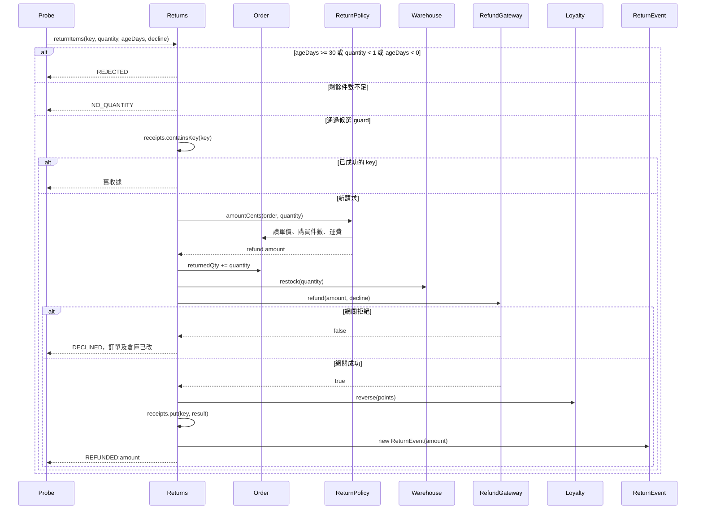

# 分批退貨政策抽取：AI code review 情境驗證

## 1. 基本說明

- **審查建議：Request changes（要求修改）。** 4 項已確認且未解除的阻擋問題；沒有本次約定範圍內的必要證據缺口。[直接看問題](#4-審查結果與問題)。
- **現在先做：** 先修正拒付時的狀態更新與成功請求重播順序，再修正 30 天邊界及最後一批退貨的運費；最後以相同八個案例重驗。
- 專案：隔離建立的 Java 分批退貨 [本機 Git 版本庫](/Users/kengp3/Workspaces/mine/simple-skills/docs/research/returns-review-20260925-evidence/repo)；[固定來源與證據](/Users/kengp3/Workspaces/mine/simple-skills/docs/research/returns-review-20260925-evidence)。
- 本輪審查執行時間記錄：2026-09-25 03:12:44 +08:00（Asia/Taipei）。這是本輪已記錄的審查時點；首次讀取技能與建立情境略早，精確起始秒數未保存。
- 目的：審查將退款算式抽成 `ReturnPolicy` 後，分批退貨的退款金額、資格、拒付副作用及重播是否仍符合已固定契約。
- 執行狀態：兩個提交、全部 diff、相關類別、八個逐步案例均已查核；需求符合性 **FAIL**。這是模擬 PR，沒有遠端 PR 或平台審查動作。

## 2. 範圍說明

| 項目 | 固定資料 |
|---|---|
| 基準分支／提交 | `main` / `fe96fc04083eeb14c6af556429391cafe2555e4b` |
| 候選分支／提交 | `codex/refund-policy-extraction` / `9faef85321bd213e1a5c3e5dc7a6d5cc1191547d` |
| 比較方式 | `git diff <base>...<head>`；共同祖先為上述基準提交 |
| 變更 | 2 個 Java 檔、2 個 diff 區塊：`Returns.java` 修改、`ReturnPolicy.java` 新增；無刪檔、改名、二進位及配置變更 |

[契約 SPEC.md](/Users/kengp3/Workspaces/mine/simple-skills/docs/research/returns-review-20260925-evidence/base/SPEC.md)固定每個案例的初始訂單：3 件，每件 400 分，運費 100 分。退貨日齡 **0–30 天含第 30 天**。每次退款為退貨件數 × 400 分；只有累計退完 3 件的**最後一批**加退原運費 100 分。退款被拒絕時只增加退款嘗試次數；不得改退貨件數、入庫件數、點數、成功收據或事件。成功請求鍵重播先於會變化的資格／剩餘件數檢查，且不得重做副作用。

已讀完整 [基準 Returns](/Users/kengp3/Workspaces/mine/simple-skills/docs/research/returns-review-20260925-evidence/base/Returns.java)、[候選 Returns](/Users/kengp3/Workspaces/mine/simple-skills/docs/research/returns-review-20260925-evidence/head/Returns.java)、新增的 [ReturnPolicy](/Users/kengp3/Workspaces/mine/simple-skills/docs/research/returns-review-20260925-evidence/head/ReturnPolicy.java)、訂單／退款／庫存／點數／事件及 [Probe 入口](/Users/kengp3/Workspaces/mine/simple-skills/docs/research/returns-review-20260925-evidence/head/Probe.java)。[完整差異](/Users/kengp3/Workspaces/mine/simple-skills/docs/research/returns-review-20260925-evidence/diff.patch)及[逐步執行紀錄](/Users/kengp3/Workspaces/mine/simple-skills/docs/research/returns-review-20260925-evidence/execution.json)已固定；[完整檔案清單](#完整檔案清單)在末節。

本次只驗證同鍵同退貨件數、循序、記憶體內的替身。真實退款網關、交易提交、持久化、並行與訊息投遞未納入；隔離副本的修正綠燈不能推論正式系統的交易可靠性。

## 3. 關聯與流程

這次 diff 的兩個區塊已逐項盤點：`Returns.returnItems` 改變日齡 guard、成功收據檢查、累計退貨／入庫與退款呼叫順序；新增 `ReturnPolicy.amountCents` 接手金額計算，但運費條件從「累計退完」變成「本次一次退完」。未修改的 `Order` 提供累計數與價格，`RefundGateway` 的拒絕分支只回傳 false，`Warehouse` 立即累加入庫；`Loyalty`、成功收據與 `ReturnEvent` 只在候選退款成功後處理。

| 差異目標 | 前後行為及關係 | 影響 |
|---|---|---|
| `Returns.returnItems` | 基準先查成功鍵，再判資格及剩餘件數，退款成功後才改訂單／倉庫；候選先判資格與件數，提前更新訂單／倉庫，最後才呼叫網關 | F-001、F-002、F-003；`Probe → Returns → Order / Warehouse / RefundGateway / Loyalty / ReturnEvent` |
| `ReturnPolicy.amountCents` | 將內聯金額算式移到新類別；候選以本次 `quantity` 判斷全退，漏掉已退件數 | F-004；`Returns → ReturnPolicy → Order`，並改變網關退款及事件金額 |

因這次問題取決於 **guard 與跨類別副作用順序**，使用一張候選版本循序圖。它由固定候選原碼推導，不是逐箭頭 runtime tracing；基準差異已列於上表。



圖中的 guard、呼叫及副作用位置可從[候選 Returns 第 13–25 行](/Users/kengp3/Workspaces/mine/simple-skills/docs/research/returns-review-20260925-evidence/head/Returns.java:13)、[Policy 第 2–4 行](/Users/kengp3/Workspaces/mine/simple-skills/docs/research/returns-review-20260925-evidence/head/ReturnPolicy.java:2)、[網關第 3–9 行](/Users/kengp3/Workspaces/mine/simple-skills/docs/research/returns-review-20260925-evidence/head/RefundGateway.java:3)核對。逐步觀測只證明每次呼叫結束後的狀態；[已渲染循序圖](/Users/kengp3/Workspaces/mine/simple-skills/docs/research/returns-review-20260925-evidence/flow.png)已檢視箭頭、guard 與失敗出口。

## 4. 審查結果與問題

`F` 是已確認缺陷，四項均由候選提交引入且狀態為 **open**；`U` 是必要證據缺口，本次沒有 U。四項都違反明文契約，阻擋本模擬 PR 通過。

| 問題 | 具體影響 | 推薦修正／解除 |
|---|---|---|
| [F-001](#f-001：第-30-天被當作逾期) 第 30 天錯誤拒絕 | 合格退 1 件應退 400 分，候選回 `REJECTED` | `ageDays > 30` 才拒絕；day30 重驗 |
| [F-002](#f-002：退款被拒絕前已改訂單與倉庫) 拒付仍更新訂單與倉庫 | 退款 0 分但已標退 1 件、入庫 1 件，重試再加一次 | 網關成功後才更新；decline_retry 兩步重驗 |
| [F-003](#f-003：成功重播在收據查詢前被拒絕) 重播先經可變 guard | 全退重播回 `NO_QUANTITY`，逾期重播回 `REJECTED` | 成功收據先查；兩種重播結果與副作用重驗 |
| [F-004](#f-004：最後一批退貨漏退運費) 分批退完漏退運費 | 最後一批 2 件少退 100 分，事件也少記 100 分 | 用累計退貨數判全退；partial_final 重驗 |

### F-001：第 30 天被當作逾期

位置：[候選 `Returns.returnItems(String,int,int,boolean)` 第 13–16 行](/Users/kengp3/Workspaces/mine/simple-skills/docs/research/returns-review-20260925-evidence/head/Returns.java:13)。原碼顯示 `ageDays` 參數、拒絕條件及後續剩餘件數／收據判斷：

```java
    String returnItems(String key, int quantity, int ageDays, boolean decline) {
        if (quantity < 1 || ageDays < 0 || ageDays >= 30) return "REJECTED";
        if (order.returnedQty + quantity > order.purchasedQty) return "NO_QUANTITY";
        if (receipts.containsKey(key)) return receipts.get(key);
```

建議修改第 14 行（隔離修正副本已測；不代表受審提交已修）：

```java
// 第 30 天仍在契約允許範圍內。
if (quantity < 1 || ageDays < 0 || ageDays > 30) return "REJECTED";
```

規格明定第 30 天可退。[Probe day30 第 25 行](/Users/kengp3/Workspaces/mine/simple-skills/docs/research/returns-review-20260925-evidence/head/Probe.java:25)以新訂單退 1 件：基準 `REFUNDED:400`、候選 `REJECTED` 且退款嘗試為 0；[逐步輸出](/Users/kengp3/Workspaces/mine/simple-skills/docs/research/returns-review-20260925-evidence/execution.json)可核對。第 31 天兩版皆拒絕，無法排除第 30 天邊界錯誤。解除條件是 day30 成功，after_window 仍拒絕，相關副作用與退款一致。

### F-002：退款被拒絕前已改訂單與倉庫

位置：[候選 `Returns.returnItems(String,int,int,boolean)` 第 17–21 行](/Users/kengp3/Workspaces/mine/simple-skills/docs/research/returns-review-20260925-evidence/head/Returns.java:17)。`order`、`warehouse`、`gateway` 欄位原始宣告在[第 6–8 行](/Users/kengp3/Workspaces/mine/simple-skills/docs/research/returns-review-20260925-evidence/head/Returns.java:6)：

```java
    final Order order = new Order();
    final Warehouse warehouse = new Warehouse();
    final RefundGateway gateway = new RefundGateway();
```

金額來源、累計退貨與入庫副作用、網關拒絕及後續點數使用在連續原碼中：

```java
        int amountCents = policy.amountCents(order, quantity);
        order.returnedQty += quantity;
        warehouse.restock(quantity);
        if (!gateway.refund(amountCents, decline)) return "DECLINED";
        loyalty.reverse(quantity * order.unitCents / 100);
```

[倉庫第 2–3 行](/Users/kengp3/Workspaces/mine/simple-skills/docs/research/returns-review-20260925-evidence/head/Warehouse.java:2)會立即累加入庫；[網關第 3–9 行](/Users/kengp3/Workspaces/mine/simple-skills/docs/research/returns-review-20260925-evidence/head/RefundGateway.java:3)的拒絕分支只回傳 false，沒有補償：

```java
    int restockedQty;
    void restock(int quantity) { restockedQty += quantity; }
```

```java
    boolean refund(int amountCents, boolean decline) {
        attempts++;
        if (decline) return false;
        successfulRefunds++;
        refundedCents += amountCents;
        return true;
    }
```

建議修改執行順序（與 F-003、F-004 的整合示意見下方；隔離副本八案已測）：

```java
int amountCents = policy.amountCents(order, quantity);
if (!gateway.refund(amountCents, decline)) return "DECLINED";
// 只有本次退款成功，才變更退貨與入庫狀態。
order.returnedQty += quantity;
warehouse.restock(quantity);
```

[decline_retry](/Users/kengp3/Workspaces/mine/simple-skills/docs/research/returns-review-20260925-evidence/head/Probe.java:26)第一步退款拒絕後，基準退貨／入庫件數皆 0，候選皆 1，但兩者實際退款都是 0 分；第二步同鍵成功後，基準皆 1，候選皆 2。這會使未退款的貨被當成已退且入庫。解除條件：拒付只增加嘗試次數，同鍵成功重試只更新一次，點數／收據／事件也只在成功時變動。真實網關成功後若本地更新失敗的交易處理不在本模擬保證內。

### F-003：成功重播在收據查詢前被拒絕

位置：[候選 `Returns.returnItems(String,int,int,boolean)` 第 13–17 行](/Users/kengp3/Workspaces/mine/simple-skills/docs/research/returns-review-20260925-evidence/head/Returns.java:13)。成功收據欄位的宣告在[第 11 行](/Users/kengp3/Workspaces/mine/simple-skills/docs/research/returns-review-20260925-evidence/head/Returns.java:11)；第 12 行為事件欄位，與收據查詢順序無關，故分段呈現：

```java
    final Map<String,String> receipts = new LinkedHashMap<>();
```

```java
    String returnItems(String key, int quantity, int ageDays, boolean decline) {
        if (quantity < 1 || ageDays < 0 || ageDays >= 30) return "REJECTED";
        if (order.returnedQty + quantity > order.purchasedQty) return "NO_QUANTITY";
        if (receipts.containsKey(key)) return receipts.get(key);
        int amountCents = policy.amountCents(order, quantity);
```

建議先查成功收據，再判斷**新請求**當前是否合格；仍保留 F-001 的邊界修正：

```java
// 同鍵同退貨件數的成功請求直接回原結果，不重新檢查剩餘件數或目前日齡。
if (receipts.containsKey(key)) return receipts.get(key);
if (quantity < 1 || ageDays < 0 || ageDays > 30) return "REJECTED";
if (order.returnedQty + quantity > order.purchasedQty) return "NO_QUANTITY";
```

[replay_full](/Users/kengp3/Workspaces/mine/simple-skills/docs/research/returns-review-20260925-evidence/head/Probe.java:28)在 3 件全退後同鍵重播：基準仍回 `REFUNDED:1300`，候選回 `NO_QUANTITY`。[replay_expired](/Users/kengp3/Workspaces/mine/simple-skills/docs/research/returns-review-20260925-evidence/head/Probe.java:30)把已成功收據在第 31 天再查：基準回 `REFUNDED:400`，候選回 `REJECTED`。兩案例都沒有增加第二次退款，但結果違反收據重播契約；F-001 只改 `>=` 無法修正第 31 天的重播。解除需兩次重播均回原結果，網關嘗試、訂單、入庫、點數與事件計數不變。

### F-004：最後一批退貨漏退運費

位置：[候選 `ReturnPolicy.amountCents(Order,int)` 第 2–4 行](/Users/kengp3/Workspaces/mine/simple-skills/docs/research/returns-review-20260925-evidence/head/ReturnPolicy.java:2)。[Order 第 2–5 行](/Users/kengp3/Workspaces/mine/simple-skills/docs/research/returns-review-20260925-evidence/head/Order.java:2)顯示購買件數、單價、運費及累計已退件數的宣告與初值：

```java
    final int purchasedQty = 3;
    final int unitCents = 400;
    final int shippingCents = 100;
    int returnedQty;
```

```java
    int amountCents(Order order, int quantity) {
        return quantity * order.unitCents
            + (quantity == order.purchasedQty ? order.shippingCents : 0);
```

建議使用**計算當下**的累計已退件數，並維持 F-002 建議的「退款成功後才更新」順序：

```java
int amountCents(Order order, int quantity) {
    // 本批完成累計全退時，才退原運費。
    return quantity * order.unitCents
        + (order.returnedQty + quantity == order.purchasedQty ? order.shippingCents : 0);
}
```

[partial_final](/Users/kengp3/Workspaces/mine/simple-skills/docs/research/returns-review-20260925-evidence/head/Probe.java:23)先退 1 件、再退 2 件；第二次應退 2×400+100＝900 分。候選只退 800 分，總退款 1200 分而非 1300 分；第二筆事件也記 800 而非 900 分。一次退 3 件仍有加退運費，不能反證分批案例。解除需最後一批退款、網關累計與事件金額皆為 900／1300 分，同時正常單件退貨不提前退運費。

**整合修正順序：** 先把成功收據檢查搬回所有可變 guard 之前，再修 30 天 guard 與 `ReturnPolicy` 的累計判斷，最後將訂單／入庫更新移到網關成功之後。這是隔離驗證用的參考實作，並未改動候選 Git 提交；[修正副本](/Users/kengp3/Workspaces/mine/simple-skills/docs/research/returns-review-20260925-evidence/repair)已編譯，八案逐步輸出均與基準一致（[驗證紀錄](/Users/kengp3/Workspaces/mine/simple-skills/docs/research/returns-review-20260925-evidence/repair-validation.json)）。實際 PR 修正後仍需對新提交重審。

已查但未列問題：超量退貨與第 31 天首次退貨皆正確拒絕；正常單件退貨的退款、入庫、點數、收據與事件一致。`ReturnEvent` 序列化與 `Loyalty.reverse` 未在 diff 中改動，但已核對呼叫位置及觀測。此測試沒有外部授權、持久化或併行入口，故不能據此宣稱那些面向安全；也沒有依賴或配置變更需查。

## 5. 結論

對固定候選提交 `9faef85321bd213e1a5c3e5dc7a6d5cc1191547d`，建議 **Request changes**。F-001 至 F-004 均未在受審提交解除；八案中五案有可觀測差異，三案一致。先依上方整合順序修改，再固定新的 head，重跑 day30、decline_retry、replay_full、replay_expired、partial_final 及其餘三案；逐步核對退款、退貨／入庫、點數、收據與事件後才重新判斷可否通過。隔離修正副本的綠燈只驗證建議方向，不等於正式 PR 已修復。

### 證據與可重現方式

- [情境產生與執行腳本](/Users/kengp3/Workspaces/mine/simple-skills/tests/poc_returns_review.py)；執行 `python3 tests/poc_returns_review.py --out <新目錄>` 可重建一包隔離情境。它只用 Python 標準函式庫、Git 與 JDK。
- [執行環境](/Users/kengp3/Workspaces/mine/simple-skills/docs/research/returns-review-20260925-evidence/environment.json)、[原始編譯／案例 stdout、退出碼與來源 hash](/Users/kengp3/Workspaces/mine/simple-skills/docs/research/returns-review-20260925-evidence/execution.json)、[逐案例差異摘要](/Users/kengp3/Workspaces/mine/simple-skills/docs/research/returns-review-20260925-evidence/comparison.json)。兩側各 `javac` 成功、8/8 案例命令退出碼 0；是否符合契約另依上文判斷。
- 使用 skill 的 `review.py prepare` 固定兩個提交，再執行 `review.py verify`，回傳 `VERIFIED`；[快照及 manifest](/Users/kengp3/Workspaces/mine/simple-skills/docs/research/returns-review-20260925-evidence/frozen)已保存。來源 Git 仍在本機，沒有推送。
- 本輪採用的 [SKILL.md](/Users/kengp3/Workspaces/mine/simple-skills/skills/ai-code-review/SKILL.md) SHA-256 `38aee86693690fa4a69023e19359c2caa771e827f9add9d17548327dca4d1452`；[深度審查規則](/Users/kengp3/Workspaces/mine/simple-skills/skills/ai-code-review/references/deep-review.md) `5b57525acc0dd12d4e5afb017eb170d9fd4d4bd047d672af1d282a79fff724de`；[報告規則](/Users/kengp3/Workspaces/mine/simple-skills/skills/ai-code-review/references/report.md) `8bf2037fe8719ce2f72b133c145ac0bf228a323a73a7b288201d71f27f8540ee`。
- [差異 patch](/Users/kengp3/Workspaces/mine/simple-skills/docs/research/returns-review-20260925-evidence/diff.patch) SHA-256 `7a598bb821104df2179a2310fc83c3471f0feb145483f8738db4a36ee961c2b6`；[執行紀錄](/Users/kengp3/Workspaces/mine/simple-skills/docs/research/returns-review-20260925-evidence/execution.json) SHA-256 `f54f05d4cfbf837bac5d341fd2b9cf5d68d8e26159e3f4988962cc53a548243e`。
- 導覽修訂：移除七處只供頁內跳轉的 HTML 錨點，連結改指向現有 Markdown 標題；原始審查採用的報告規則雜湊如上，修訂後規則為 `aaa75a084e9e8c1564a470707fb2fbd4e46210ed344a38e8f35b1af167c6ea7a`。此修訂未重新執行 Java，亦未改變問題或結論。

### 完整檔案清單

| 版本庫路徑 | 狀態／責任 | 差異作用與審查結果 |
|---|---|---|
| [Returns.java](/Users/kengp3/Workspaces/mine/simple-skills/docs/research/returns-review-20260925-evidence/head/Returns.java) | 修改；退貨入口與協調 | 唯一修改區塊已逐行核對基準、guard、收據、退款與副作用；F-001、F-002、F-003；F-004 的呼叫者。 |
| [ReturnPolicy.java](/Users/kengp3/Workspaces/mine/simple-skills/docs/research/returns-review-20260925-evidence/head/ReturnPolicy.java) | 新增；退款算式 | 唯一新增區塊已核對訂單欄位與分批案例；F-004。 |

關聯但未修改的來源：[SPEC.md](/Users/kengp3/Workspaces/mine/simple-skills/docs/research/returns-review-20260925-evidence/head/SPEC.md)（驗收規則）、[Order.java](/Users/kengp3/Workspaces/mine/simple-skills/docs/research/returns-review-20260925-evidence/head/Order.java)（初始與累計狀態）、[Warehouse.java](/Users/kengp3/Workspaces/mine/simple-skills/docs/research/returns-review-20260925-evidence/head/Warehouse.java)（入庫副作用）、[RefundGateway.java](/Users/kengp3/Workspaces/mine/simple-skills/docs/research/returns-review-20260925-evidence/head/RefundGateway.java)（拒付及金額）、[Loyalty.java](/Users/kengp3/Workspaces/mine/simple-skills/docs/research/returns-review-20260925-evidence/head/Loyalty.java)（點數）、[ReturnEvent.java](/Users/kengp3/Workspaces/mine/simple-skills/docs/research/returns-review-20260925-evidence/head/ReturnEvent.java)（事件）、[Probe.java](/Users/kengp3/Workspaces/mine/simple-skills/docs/research/returns-review-20260925-evidence/head/Probe.java)（案例入口與逐步觀測）。上述均已讀取；未將其誤列成提交差異。
